# 数学知识关联思维导图 | Mathematical Knowledge Connectivity Mind Map

## 思维导图总览 | Mind Map Overview

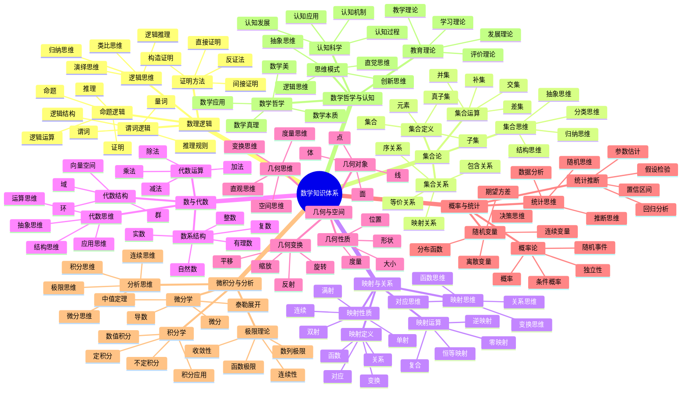

## 知识关联深度分析 | Deep Knowledge Connectivity Analysis

### 1. 逻辑-集合关联 | Logic-Set Connectivity

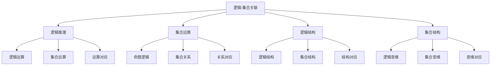

#### 关联机制

- **逻辑运算** ↔ **集合运算**：逻辑运算与集合运算的对应关系
- **命题逻辑** ↔ **集合关系**：命题的真值与集合的包含关系
- **逻辑结构** ↔ **集合结构**：逻辑结构与集合结构的对应
- **逻辑思维** ↔ **集合思维**：逻辑思维与集合思维的关联

#### 教学应用

- **概念对比**：通过对比逻辑运算与集合运算发现关联
- **方法迁移**：将逻辑推理方法迁移到集合问题
- **思维训练**：通过逻辑-集合关联训练抽象思维
- **应用拓展**：在集合问题中应用逻辑推理

### 2. 集合-映射关联 | Set-Mapping Connectivity

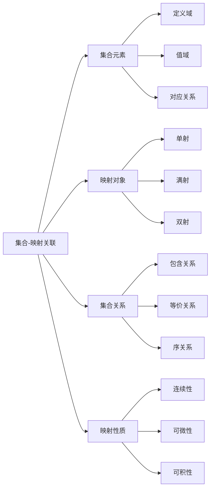

#### 2.1 关联机制

- **集合元素** ↔ **映射对象**：集合元素作为映射的定义域和值域
- **集合关系** ↔ **映射性质**：集合关系决定映射的性质
- **集合运算** ↔ **映射运算**：集合运算与映射运算的对应
- **集合结构** ↔ **映射结构**：集合结构决定映射的结构

#### 2.2 教学应用

- **概念递进**：从集合概念递进到映射概念
- **性质类比**：通过类比理解集合与映射的性质
- **方法整合**：整合集合方法与映射方法
- **应用深化**：在映射应用中深化集合理解

### 3. 映射-代数关联 | Mapping-Algebra Connectivity

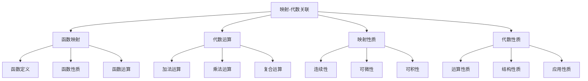

#### 3.1 关联机制

- **函数映射** ↔ **代数运算**：函数是特殊的代数映射
- **映射性质** ↔ **代数性质**：映射的性质决定代数性质
- **映射运算** ↔ **代数运算**：映射运算与代数运算的对应
- **映射结构** ↔ **代数结构**：映射结构决定代数结构

#### 3.2 教学应用

- **概念整合**：整合映射概念与代数概念
- **方法迁移**：将映射方法迁移到代数问题
- **思维拓展**：通过映射-代数关联拓展思维
- **应用创新**：在代数应用中创新映射方法

### 4. 代数-几何关联 | Algebra-Geometry Connectivity

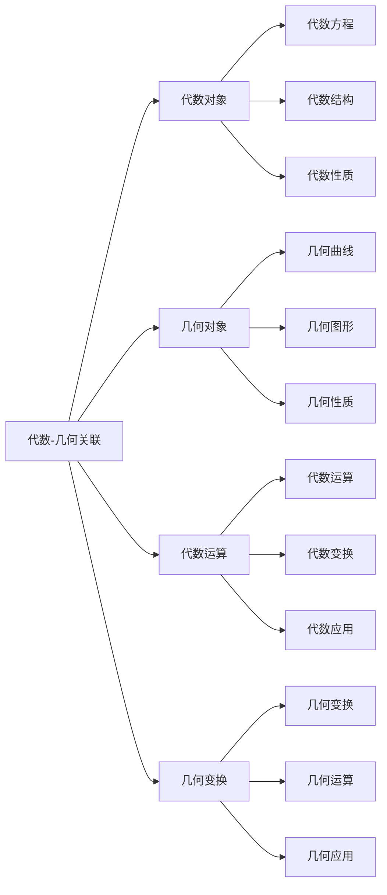

#### 4.1 关联机制

- **代数对象** ↔ **几何对象**：代数方程对应几何曲线
- **代数运算** ↔ **几何变换**：代数运算对应几何变换
- **代数性质** ↔ **几何性质**：代数性质决定几何性质
- **代数结构** ↔ **几何结构**：代数结构决定几何结构

#### 4.2 教学应用

- **多表征教学**：通过代数与几何的多表征理解概念
- **方法整合**：整合代数方法与几何方法
- **思维训练**：通过代数-几何关联训练综合思维
- **应用拓展**：在几何应用中拓展代数方法

### 5. 几何-分析关联 | Geometry-Analysis Connectivity

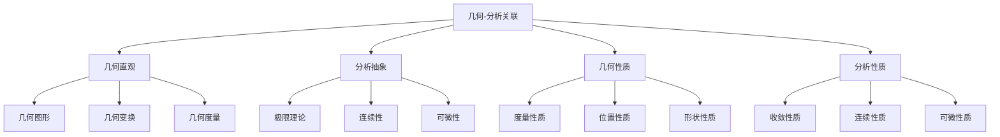

#### 5.1 关联机制

- **几何直观** ↔ **分析抽象**：几何直观为分析提供直观基础
- **几何性质** ↔ **分析性质**：几何性质决定分析性质
- **几何变换** ↔ **分析变换**：几何变换对应分析变换
- **几何度量** ↔ **分析度量**：几何度量决定分析度量

#### 5.2 教学应用

- **直观教学**：通过几何直观理解分析概念
- **方法迁移**：将几何方法迁移到分析问题
- **思维深化**：通过几何-分析关联深化思维
- **应用创新**：在分析应用中创新几何方法

### 6. 分析-统计关联 | Analysis-Statistics Connectivity

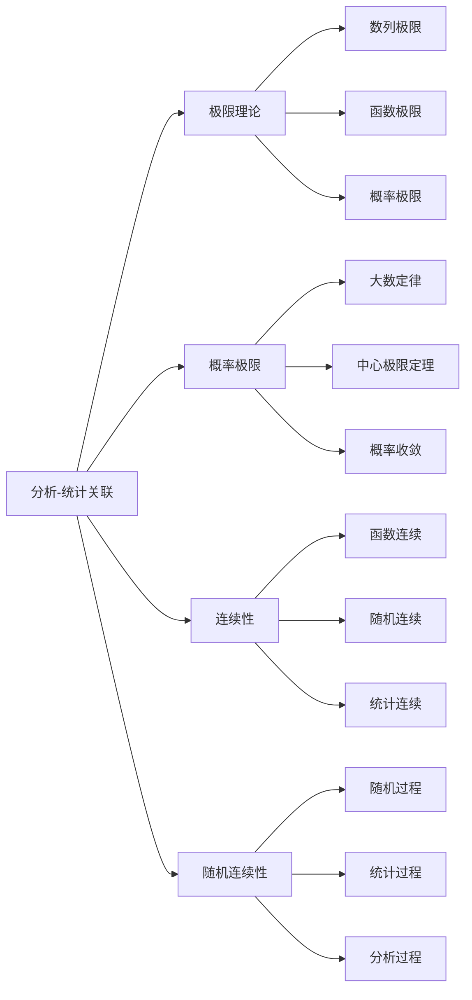

#### 6.1 关联机制

- **极限理论** ↔ **概率极限**：极限理论为概率论提供基础
- **连续性** ↔ **随机连续性**：连续性决定随机连续性
- **可微性** ↔ **概率密度**：可微性与概率密度相关
- **可积性** ↔ **统计积分**：可积性与统计积分相关

#### 6.2 教学应用

- **理论应用**：将分析理论应用到统计问题
- **方法整合**：整合分析方法与统计方法
- **思维拓展**：通过分析-统计关联拓展思维
- **应用深化**：在统计应用中深化分析理解

## 思维结构分析 | Thinking Structure Analysis

### 1. 直觉思维结构 | Intuitive Thinking Structure

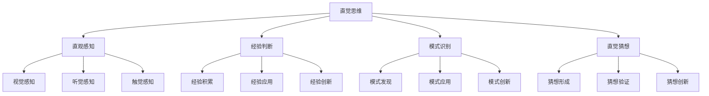

### 2. 逻辑思维结构 | Logical Thinking Structure

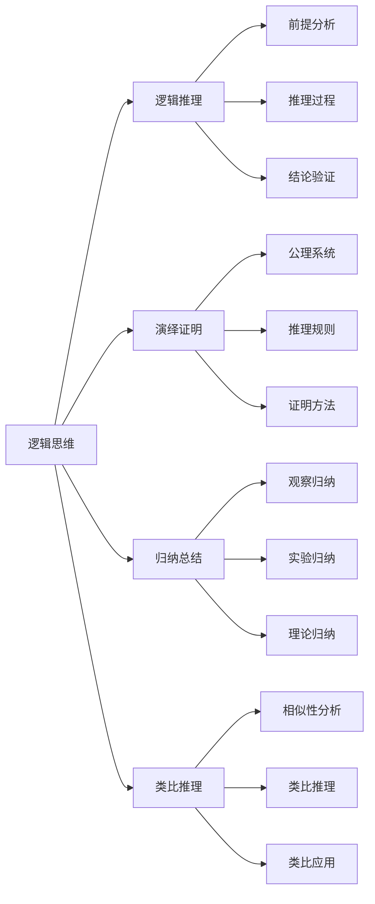

### 3. 抽象思维结构 | Abstract Thinking Structure

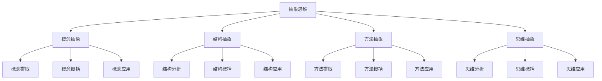

### 4. 创新思维结构 | Innovative Thinking Structure

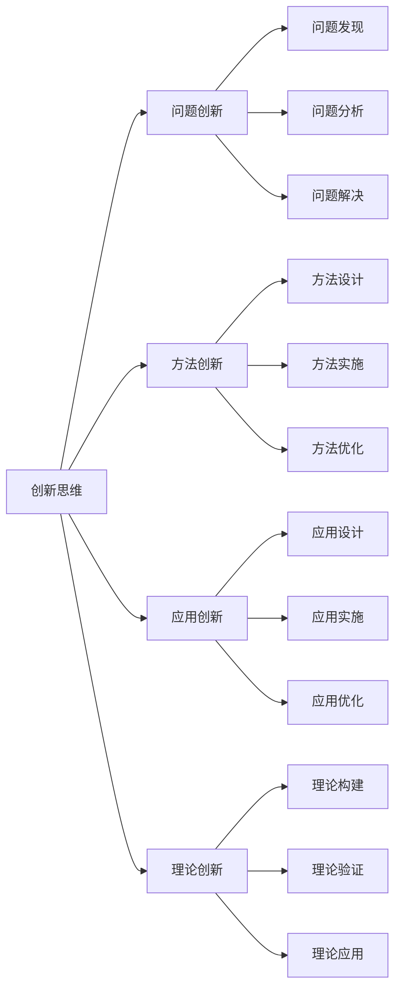

## 知识关联教学策略 | Knowledge Connectivity Teaching Strategies

### 1. 概念关联教学策略 | Concept Connectivity Teaching Strategy

#### 教学原则

- **关联性原则**：强调概念间的关联性
- **结构性原则**：注重知识的结构性
- **发展性原则**：关注思维的发展性
- **应用性原则**：重视知识的应用性

#### 教学方法

- **对比教学法**：通过对比发现概念关联
- **递进教学法**：通过递进建立概念链条
- **整合教学法**：通过整合形成概念网络
- **应用教学法**：通过应用深化概念理解

### 2. 方法关联教学策略 | Method Connectivity Teaching Strategy

#### 2.1 教学原则

- **迁移性原则**：强调方法的迁移性
- **整合性原则**：注重方法的整合性
- **创新性原则**：关注方法的创新性
- **优化性原则**：重视方法的优化性

#### 2.2 教学方法

- **迁移教学法**：通过迁移应用方法
- **整合教学法**：通过整合优化方法
- **创新教学法**：通过创新拓展方法
- **优化教学法**：通过优化改进方法

### 3. 应用关联教学策略 | Application Connectivity Teaching Strategy

#### 3.1 教学原则

- **跨学科原则**：强调应用的跨学科性
- **实际性原则**：注重应用的实际性
- **创新性原则**：关注应用的创新性
- **综合性原则**：重视应用的综合性

#### 3.2 教学方法

- **跨学科教学法**：通过跨学科拓展应用
- **实际应用教学法**：通过实际应用深化理解
- **创新应用教学法**：通过创新应用拓展思维
- **综合应用教学法**：通过综合应用整合知识

## 知识关联评价体系 | Knowledge Connectivity Evaluation System

### 1. 概念理解评价 | Concept Understanding Evaluation

#### 评价维度

- **概念准确性**：概念理解的准确性
- **概念关联性**：概念关联的理解程度
- **概念应用性**：概念应用的能力
- **概念创新性**：概念创新的能力

#### 评价方法

- **概念测试**：通过测试评价概念理解
- **概念应用**：通过应用评价概念理解
- **概念创新**：通过创新评价概念理解
- **概念反思**：通过反思评价概念理解

### 2. 方法掌握评价 | Method Mastery Evaluation

#### 2.1 评价维度

- **方法准确性**：方法掌握的准确性
- **方法灵活性**：方法应用的灵活性
- **方法创新性**：方法创新的能力
- **方法整合性**：方法整合的能力

#### 2.2 评价方法

- **方法测试**：通过测试评价方法掌握
- **方法应用**：通过应用评价方法掌握
- **方法创新**：通过创新评价方法掌握
- **方法反思**：通过反思评价方法掌握

### 3. 应用能力评价 | Application Ability Evaluation

#### 3.1 评价维度

- **应用准确性**：应用能力的准确性
- **应用灵活性**：应用能力的灵活性
- **应用创新性**：应用创新的能力
- **应用整合性**：应用整合的能力

#### 3.2 评价方法

- **应用测试**：通过测试评价应用能力
- **应用实践**：通过实践评价应用能力
- **应用创新**：通过创新评价应用能力
- **应用反思**：通过反思评价应用能力

## 知识关联发展展望 | Knowledge Connectivity Development Prospects

### 1. 技术发展趋势 | Technology Development Trends

#### 人工智能应用

- **智能关联**：AI辅助知识关联发现
- **智能教学**：AI辅助知识关联教学
- **智能评价**：AI辅助知识关联评价
- **智能创新**：AI辅助知识关联创新

#### 虚拟现实应用

- **虚拟关联**：VR辅助知识关联探索
- **虚拟教学**：VR辅助知识关联教学
- **虚拟应用**：VR辅助知识关联应用
- **虚拟创新**：VR辅助知识关联创新

### 2. 教育发展趋势 | Education Development Trends

#### 个性化学习

- **个性化关联**：根据个人特点设计关联学习
- **个性化教学**：根据个人特点设计关联教学
- **个性化评价**：根据个人特点设计关联评价
- **个性化发展**：根据个人特点促进关联发展

#### 协作学习

- **协作关联**：通过协作进行知识关联探索
- **协作教学**：通过协作进行知识关联教学
- **协作应用**：通过协作进行知识关联应用
- **协作创新**：通过协作进行知识关联创新

### 3. 研究发展趋势 | Research Development Trends

#### 认知科学研究

- **认知过程**：研究知识关联的认知过程
- **认知机制**：研究知识关联的认知机制
- **认知发展**：研究知识关联的认知发展
- **认知应用**：研究知识关联的认知应用

#### 教育学研究

- **教学理论**：发展知识关联的教学理论
- **学习理论**：发展知识关联的学习理论
- **评价理论**：发展知识关联的评价理论
- **发展理论**：发展知识关联的发展理论

---

*本思维导图为SeniorMath项目的核心内容之一，旨在通过系统化的知识关联分析，为数学教育提供科学、完整、实用的知识体系参考。*
