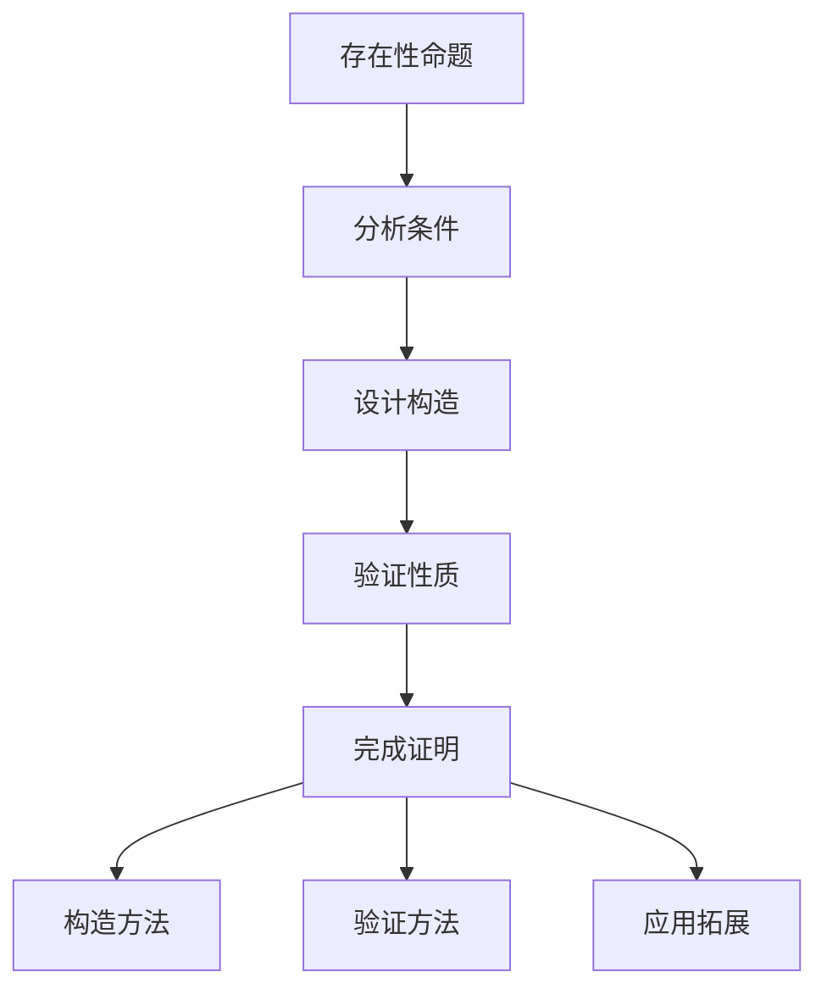
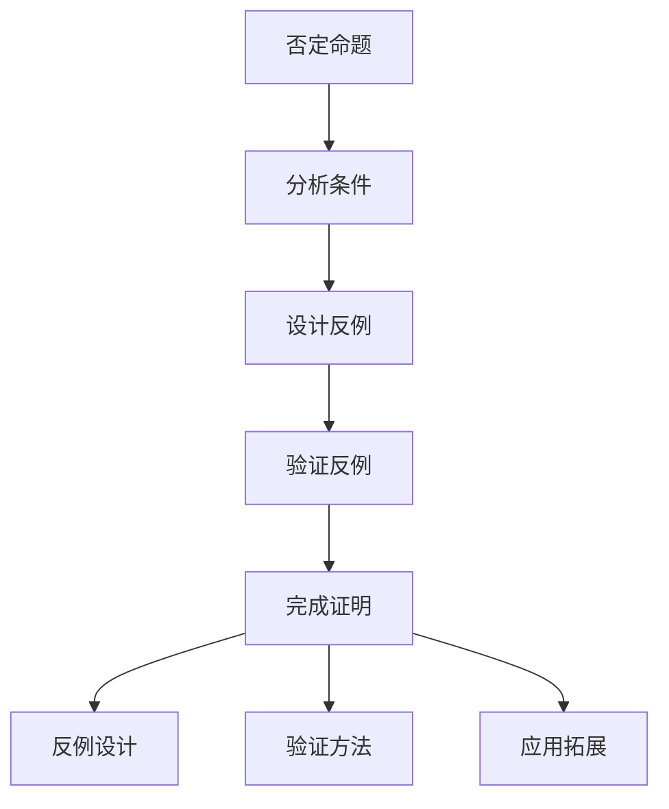
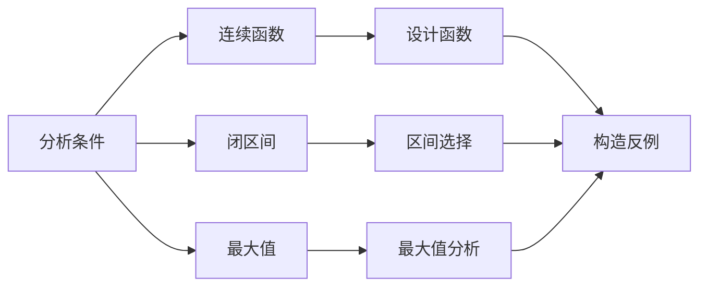
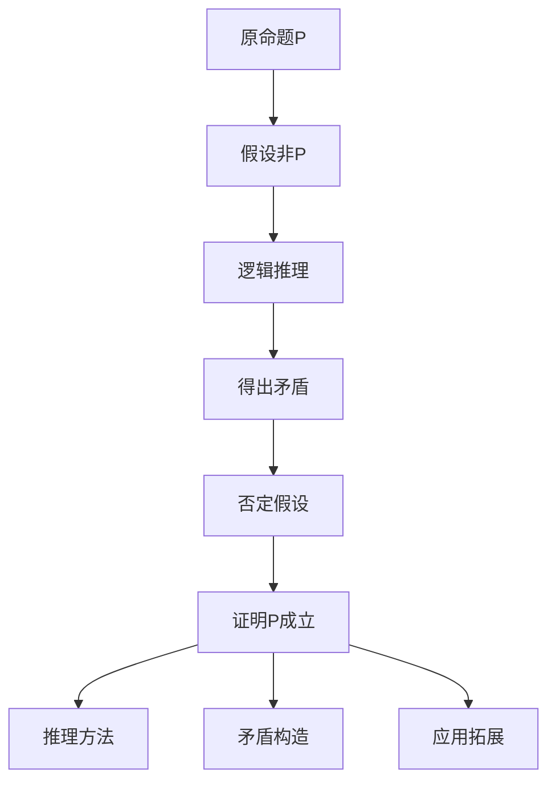
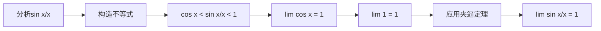
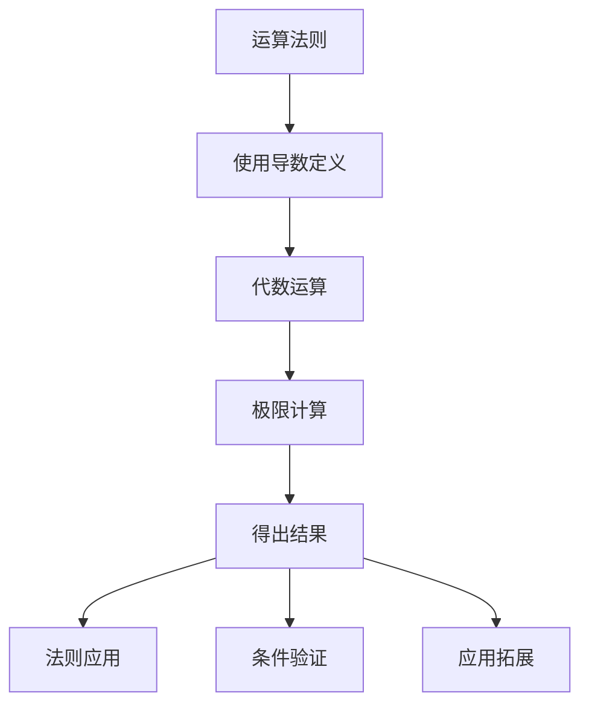

# 高级数学证明技巧集 | Advanced Mathematical Proof Techniques Collection

## 证明技巧总览 | Proof Techniques Overview

### 1. 构造性证明技巧 | Constructive Proof Techniques

#### 1.1 存在性构造证明 | Existence Constructive Proof

**技巧描述**：
通过具体构造出满足条件的对象来证明存在性命题。

**基本流程**：



**示例1：连续函数构造**
**命题**：存在一个在R上连续的函数f(x)，使得f(x)在x = 0处可导，但在x = 1处不可导。

**构造方法**：

```mermaid
graph LR
    A[分析条件] --> B[连续性要求]
    A --> C[可导性要求]
    A --> D[不可导性要求]
    
    B --> E[分段函数]
    C --> F[导数计算]
    D --> G[极限分析]
    
    E --> H[构造f(x)]
    F --> H
    G --> H
```

**构造过程**：

1. **分段设计**：f(x) = x² (x ≤ 1), f(x) = 2x - 1 (x > 1)
2. **连续性验证**：在x = 1处左右极限相等
3. **可导性分析**：在x = 0处导数存在，在x = 1处导数不存在
4. **性质验证**：验证所有条件都满足

**技巧要点**：

- **条件分析**：仔细分析所有条件要求
- **分段构造**：利用分段函数满足不同条件
- **极限计算**：通过极限验证连续性和可导性
- **性质验证**：逐一验证所有性质

#### 1.2 反例构造证明 | Counterexample Construction Proof

**技巧描述**：
通过构造反例来证明某个命题不成立。

**基本流程**：



**示例2：函数性质反例**
**命题**：若函数f(x)在[a,b]上连续，则f(x)在[a,b]上一定有最大值。

**反例构造**：



**反例构造**：

1. **函数设计**：f(x) = 1/(1-x) 在[0,1)上
2. **区间分析**：在[0,1)上连续但无最大值
3. **性质验证**：验证连续性和无最大值性
4. **结论得出**：原命题不成立

**技巧要点**：

- **条件分析**：分析命题的所有条件
- **反例设计**：设计满足条件但不满足结论的例子
- **性质验证**：验证反例的所有性质
- **逻辑推理**：通过反例否定原命题

### 2. 间接证明技巧 | Indirect Proof Techniques

#### 2.1 反证法技巧 | Contradiction Proof Technique

**技巧描述**：
通过假设结论不成立，推导出矛盾来证明原命题。

**基本流程**：



**示例3：无理数证明**
**命题**：√2是无理数。

**反证法证明**：


**证明过程**：

1. **假设**：假设√2 = p/q，其中p,q互质
2. **平方**：p² = 2q²
3. **分析**：p²为偶数，故p为偶数
4. **代入**：设p = 2k，得q² = 2k²
5. **矛盾**：q也为偶数，与p,q互质矛盾
6. **结论**：假设错误，√2为无理数

**技巧要点**：

- **假设明确**：明确假设的内容
- **逻辑严密**：每一步推理都要严密
- **矛盾构造**：构造明确的矛盾
- **结论明确**：明确否定假设，肯定原命题

#### 2.2 数学归纳法技巧 | Mathematical Induction Technique

**技巧描述**：
通过证明基础情况和归纳步骤来证明对所有自然数成立的命题。

**基本流程**：

```mermaid
graph TD
    A[命题P(n)] --> B[基础情况P(1)]
    A --> C[归纳假设P(k)]
    A --> D[归纳步骤P(k+1)]
    
    B --> E[验证P(1)]
    C --> F[假设P(k)成立]
    D --> G[证明P(k+1)成立]
    
    E --> H[完成证明]
    F --> H
    G --> H
```

**示例4：数列求和公式**
**命题**：1 + 2 + 3 + ... + n = n(n+1)/2

**归纳法证明**：

```mermaid
graph LR
    A[基础情况n=1] --> B[验证1=1×2/2]
    A --> C[归纳假设]
    A --> D[归纳步骤]
    
    C --> E[假设1+2+...+k=k(k+1)/2]
    D --> F[证明1+2+...+k+(k+1)=(k+1)(k+2)/2]
    
    B --> G[完成证明]
    E --> G
    F --> G
```

**证明过程**：

1. **基础情况**：n = 1时，1 = 1×2/2，成立
2. **归纳假设**：假设n = k时成立，即1+2+...+k = k(k+1)/2
3. **归纳步骤**：证明n = k+1时成立
   - 1+2+...+k+(k+1) = k(k+1)/2 + (k+1)
   - = (k+1)(k/2 + 1) = (k+1)(k+2)/2
4. **结论**：由数学归纳法，命题对所有自然数成立

**技巧要点**：

- **基础验证**：严格验证基础情况
- **假设明确**：明确归纳假设的内容
- **步骤严密**：归纳步骤的推理要严密
- **结论完整**：明确应用归纳原理

### 3. 极限证明技巧 | Limit Proof Techniques

#### 3.1 ε-δ语言技巧 | Epsilon-Delta Language Technique

**技巧描述**：
使用ε-δ语言严格证明函数极限。

**基本流程**：

```mermaid
graph TD
    A[极限lim(x→a)f(x)=L] --> B[给定ε>0]
    B --> C[寻找δ>0]
    C --> D[验证条件]
    D --> E[完成证明]
    
    E --> F[δ的构造]
    E --> G[不等式处理]
    E --> H[应用拓展]
```

**示例5：线性函数极限**
**命题**：证明lim(x→2)(3x+1) = 7

**ε-δ证明**：

```mermaid
graph LR
    A[给定ε>0] --> B[分析|3x+1-7|]
    B --> C[|3x-6|<ε]
    C --> D[|x-2|<ε/3]
    D --> E[取δ=ε/3]
    
    E --> F[验证条件]
    F --> G[完成证明]
```

**证明过程**：

1. **给定ε**：任给ε > 0
2. **分析不等式**：|3x+1-7| = |3x-6| = 3|x-2|
3. **构造δ**：取δ = ε/3
4. **验证条件**：当0 < |x-2| < δ时
   - |3x+1-7| = 3|x-2| < 3δ = ε
5. **结论**：lim(x→2)(3x+1) = 7

**技巧要点**：

- **ε的任意性**：强调ε的任意性
- **δ的构造**：根据ε构造合适的δ
- **不等式处理**：熟练处理绝对值不等式
- **逻辑严密**：每一步都要逻辑严密

#### 3.2 夹逼定理技巧 | Squeeze Theorem Technique

**技巧描述**：
通过找到两个已知极限的函数来夹逼目标函数。

**基本流程**：

```mermaid
graph TD
    A[目标函数f(x)] --> B[寻找g(x)≤f(x)≤h(x)]
    A --> C[证明lim g(x)=L]
    A --> D[证明lim h(x)=L]
    
    C --> E[应用夹逼定理]
    D --> E
    E --> F[lim f(x)=L]
    
    F --> G[不等式构造]
    F --> H[极限计算]
    F --> I[应用拓展]
```

**示例6：重要极限**
**命题**：证明lim(x→0)(sin x)/x = 1

**夹逼定理证明**：



**证明过程**：

1. **几何分析**：利用单位圆分析sin x和x的关系
2. **构造不等式**：cos x < sin x/x < 1 (0 < x < π/2)
3. **计算极限**：lim(x→0) cos x = 1，lim(x→0) 1 = 1
4. **应用夹逼定理**：lim(x→0) sin x/x = 1

**技巧要点**：

- **不等式构造**：构造合适的不等式
- **极限计算**：计算夹逼函数的极限
- **条件验证**：验证夹逼定理的条件
- **几何直观**：利用几何直观帮助构造

### 4. 连续性证明技巧 | Continuity Proof Techniques

#### 4.1 连续性定义证明 | Continuity Definition Proof

**技巧描述**：
使用连续性的ε-δ定义证明函数连续性。

**基本流程**：

```mermaid
graph TD
    A[函数f(x)在x₀连续] --> B[给定ε>0]
    B --> C[寻找δ>0]
    C --> D[验证|f(x)-f(x₀)|<ε]
    D --> E[完成证明]
    
    E --> F[δ的构造]
    E --> G[函数分析]
    E --> H[应用拓展]
```

**示例7：多项式函数连续性**
**命题**：证明f(x) = x²在x = 2处连续

**连续性证明**：

```mermaid
graph LR
    A[给定ε>0] --> B[分析|x²-4|]
    B --> C[|x²-4|=|x-2||x+2|]
    C --> D[限制|x-2|<1]
    D --> E[|x+2|<5]
    E --> F[取δ=min(1,ε/5)]
    
    F --> G[验证条件]
    G --> H[完成证明]
```

**证明过程**：

1. **给定ε**：任给ε > 0
2. **分析函数**：|x²-4| = |x-2||x+2|
3. **限制范围**：限制|x-2| < 1，则|x+2| < 5
4. **构造δ**：取δ = min(1, ε/5)
5. **验证条件**：当|x-2| < δ时
   - |x²-4| = |x-2||x+2| < δ×5 ≤ ε
6. **结论**：f(x)在x = 2处连续

**技巧要点**：

- **函数分析**：分析函数的结构特点
- **范围限制**：适当限制变量的范围
- **δ的构造**：根据函数特点构造δ
- **条件验证**：严格验证连续性条件

#### 4.2 复合函数连续性证明 | Composite Function Continuity Proof

**技巧描述**：
利用复合函数的连续性定理证明复合函数连续性。

**基本流程**：

```mermaid
graph TD
    A[复合函数f(g(x))] --> B[证明g(x)连续]
    A --> C[证明f(x)连续]
    A --> D[应用复合函数定理]
    
    B --> E[完成证明]
    C --> E
    D --> E
    
    E --> F[定理应用]
    E --> G[条件验证]
    E --> H[应用拓展]
```

**示例8：复合函数连续性**
**命题**：证明f(x) = sin(x²)在R上连续

**复合函数证明**：

```mermaid
graph LR
    A[分析f(x)=sin(x²)] --> B[f(x)=sin(g(x))]
    B --> C[g(x)=x²]
    C --> D[证明x²连续]
    D --> E[证明sin x连续]
    E --> F[应用复合函数定理]
    
    F --> G[f(x)连续]
```

**证明过程**：

1. **函数分解**：f(x) = sin(x²) = sin(g(x))，其中g(x) = x²
2. **证明g(x)连续**：x²在R上连续（多项式函数）
3. **证明sin x连续**：sin x在R上连续（三角函数性质）
4. **应用定理**：复合函数连续性定理
5. **结论**：f(x) = sin(x²)在R上连续

**技巧要点**：

- **函数分解**：将复合函数分解为简单函数
- **基础函数**：利用基础函数的连续性
- **定理应用**：正确应用复合函数连续性定理
- **条件验证**：验证定理的所有条件

### 5. 可导性证明技巧 | Differentiability Proof Techniques

#### 5.1 导数定义证明 | Derivative Definition Proof

**技巧描述**：
使用导数的极限定义证明函数可导性。

**基本流程**：

```mermaid
graph TD
    A[函数f(x)在x₀可导] --> B[计算极限lim(h→0)[f(x₀+h)-f(x₀)]/h]
    B --> C[极限存在]
    C --> D[极限值为导数]
    D --> E[完成证明]
    
    E --> F[极限计算]
    E --> G[导数公式]
    E --> H[应用拓展]
```

**示例9：幂函数导数**
**命题**：证明f(x) = x³在x = 1处可导，并求f'(1)

**导数定义证明**：

```mermaid
graph LR
    A[计算极限] --> B[lim(h→0)[(1+h)³-1³]/h]
    B --> C[lim(h→0)[1+3h+3h²+h³-1]/h]
    C --> D[lim(h→0)[3h+3h²+h³]/h]
    D --> E[lim(h→0)[3+3h+h²]]
    E --> F[极限值为3]
    
    F --> G[f'(1)=3]
```

**证明过程**：

1. **计算极限**：lim[h→0]((1+h)³-1³)/h
2. **展开计算**：lim[h→0](1+3h+3h²+h³-1)/h
3. **简化表达式**：lim[h→0](3h+3h²+h³)/h
4. **进一步简化**：lim[h→0](3+3h+h²)
5. **计算极限**：极限值为3
6. **结论**：f(x)在x = 1处可导，且f'(1) = 3

**技巧要点**：

- **极限计算**：熟练计算各种极限
- **代数运算**：熟练进行代数运算
- **极限性质**：利用极限的基本性质
- **结论明确**：明确给出导数值

#### 5.2 导数运算法则证明 | Derivative Operation Rules Proof

**技巧描述**：
证明导数的基本运算法则。

**基本流程**：



**示例10：乘积法则**
**命题**：证明(fg)'(x) = f'(x)g(x) + f(x)g'(x)

**乘积法则证明**：

```mermaid
graph LR
    A[使用导数定义] --> B[lim(h→0)[f(x+h)g(x+h)-f(x)g(x)]/h]
    B --> C[添加中间项]
    C --> D[lim(h→0)[f(x+h)g(x+h)-f(x+h)g(x)+f(x+h)g(x)-f(x)g(x)]/h]
    D --> E[分组计算]
    E --> F[lim(h→0)f(x+h)[g(x+h)-g(x)]/h + lim(h→0)[f(x+h)-f(x)]g(x)/h]
    F --> G[f(x)g'(x) + f'(x)g(x)]
    
    G --> H[完成证明]
```

**证明过程**：

1. **使用定义**：(fg)'(x) = lim[h→0](f(x+h)g(x+h)-f(x)g(x))/h
2. **添加中间项**：lim[h→0](f(x+h)g(x+h)-f(x+h)g(x)+f(x+h)g(x)-f(x)g(x))/h
3. **分组计算**：lim(h→0)f[x+h](g(x+h)-g(x))/h + lim[h→0](f(x+h)-f(x))g(x)/h
4. **利用连续性**：f(x+h) → f(x) (h → 0)
5. **应用定义**：f(x)g'(x) + f'(x)g(x)
6. **结论**：(fg)'(x) = f'(x)g(x) + f(x)g'(x)

**技巧要点**：

- **技巧性添加**：巧妙添加中间项
- **分组处理**：合理分组进行计算
- **连续性利用**：利用函数的连续性
- **定义应用**：正确应用导数定义

## 证明技巧评价体系 | Proof Technique Evaluation System

### 1. 技巧适用性评价 | Technique Applicability Evaluation

#### 1.1 适用范围

- **问题类型**：技巧适用的数学问题类型
- **难度层次**：技巧适用的难度层次
- **学科领域**：技巧适用的学科领域
- **应用价值**：技巧的应用价值

#### 1.2 使用效果

- **证明效率**：使用技巧的证明效率
- **理解难度**：技巧的理解难度
- **掌握程度**：技巧的掌握程度
- **应用能力**：技巧的应用能力

### 2. 技巧创新性评价 | Technique Innovation Evaluation

#### 2.1 创新程度

- **方法创新**：证明方法的创新性
- **思路创新**：证明思路的创新性
- **应用创新**：应用方式的创新性
- **发展前景**：技巧的发展前景

#### 2.2 教育价值

- **教学价值**：技巧的教学价值
- **学习价值**：技巧的学习价值
- **发展价值**：技巧的发展价值
- **创新价值**：技巧的创新价值

### 3. 技巧发展展望 | Technique Development Prospects

#### 3.1 技术发展趋势

- **计算机辅助**：计算机辅助证明技巧
- **软件工具**：数学软件工具的应用
- **智能系统**：智能证明系统的发展
- **自动化证明**：自动化证明技巧的发展

#### 3.2 教育发展趋势

- **个性化技巧**：个性化证明技巧的发展
- **协作技巧**：协作证明技巧的发展
- **创新技巧**：创新证明技巧的发展
- **应用技巧**：应用证明技巧的发展

## 8. 现代前沿与跨学科创新证明技巧 | Modern Frontier and Interdisciplinary Innovative Proof Techniques

### 8.1 AI与自动化证明 | AI and Automated Proof

**技巧1：AI自动化不等式证明 | AI Automated Inequality Proof**：

- 利用Lean等自动化证明工具，形式化证明柯西-施瓦茨不等式、均值不等式等经典不等式。
- Use automated proof tools such as Lean to formalize and prove classical inequalities like Cauchy-Schwarz and mean inequalities.
- 【Lean形式化】

```lean
import data.real.basic
open_locale classical
example (a b : ℝ) : 2 * a * b ≤ a^2 + b^2 :=
begin
  have h : (a - b)^2 ≥ 0 := sq_nonneg (a - b),
  linarith,
end
```

### 8.2 知识图谱与可视化证明 | Knowledge Graphs and Visual Proofs

**技巧2：知识图谱辅助的定理证明 | Theorem Proving with Knowledge Graphs**：

- 构建定理、引理、定义、方法之间的知识图谱，辅助复杂定理的结构化证明。
- Build knowledge graphs linking theorems, lemmas, definitions, and methods to assist in structured proofs of complex theorems.
- 【LaTeX图示】

$$
\begin{array}{c}
\text{Cauchy-Schwarz} \xrightarrow{\text{implies}} \text{Triangle Inequality} \\
\text{Triangle Inequality} \xrightarrow{\text{applies to}} \text{Normed Spaces}
\end{array}
$$

### 8.3 跨学科AI建模与证明 | Interdisciplinary AI Modeling and Proof

**技巧3：AI驱动的跨学科建模与证明 | AI-driven Interdisciplinary Modeling and Proof**：

- 利用AI算法对复杂系统（如生物网络、经济系统、交通流）进行建模，并自动化推导系统性质或最优解。
- Use AI algorithms to model complex systems (e.g., biological networks, economic systems, traffic flow) and automatically derive system properties or optimal solutions.

### 8.4 脑科学与数学证明 | Neuroscience and Mathematical Proof

**技巧4：脑科学视角下的数学证明认知 | Mathematical Proof Cognition from Neuroscience Perspective**：

- 结合脑成像实验，分析不同证明策略（如归纳、反证、构造、递归）激活的脑区差异，优化证明教学与认知训练。
- Combine brain imaging experiments to analyze brain region activation differences for different proof strategies (induction, contradiction, construction, recursion), optimizing proof teaching and cognitive training.

### 8.5 哲学与自动化证明 | Philosophy and Automated Proof

**技巧5：多哲学流派下的自动化证明方法 | Automated Proof Methods under Multiple Philosophical Schools**：

- 分析形式主义、结构主义、直觉主义等流派对自动化证明流程的影响，设计多元真理观下的自动化证明策略。
- Analyze the impact of formalism, structuralism, intuitionism, etc., on automated proof processes, and design automated proof strategies under pluralistic views of truth.

### 8.6 可视化表达与创新证明 | Visualization and Innovative Proofs

**技巧6：复杂结构的可视化证明 | Visual Proofs for Complex Structures**：

- 针对高维多面体、分形、网络等复杂结构，设计可视化证明流程，结合AI/知识图谱/交互式工具，提升理解与创新。
- For complex structures such as high-dimensional polytopes, fractals, networks, design visual proof processes, combine AI/knowledge graphs/interactive tools to enhance understanding and innovation.

> 本节证明技巧持续递归扩展，结合AI、知识图谱、自动化证明、脑科学、可视化等前沿，突出高级数学证明的创新性、国际化与多学科融合。
> This section of proof techniques will be recursively expanded, integrating AI, knowledge graphs, automated proof, neuroscience, visualization, etc., highlighting the innovation, internationalization, and interdisciplinary integration of advanced mathematical proof.

---

*本高级数学证明技巧集为SeniorMath项目的核心内容之一，旨在通过系统化的证明技巧，提高学生的数学证明能力和逻辑思维能力。*

## 8. AI驱动的证明创新技巧 | AI-Driven Proof Innovation Techniques

### 8.1 智能证明辅助工具 | Intelligent Proof Assistant Tools

**AI自动化证明系统**:

- 使用Lean、Coq、Isabelle等工具进行形式化证明
- 利用AI算法辅助定理发现和证明生成
- 应用机器学习方法优化证明策略
- 使用自然语言处理技术理解证明需求

**智能证明验证**:

- 自动检查证明的正确性和完整性
- 智能识别证明中的逻辑漏洞和错误
- 提供证明改进建议和优化方案
- 生成证明的详细解释和说明

### 8.2 可视化证明技巧 | Visual Proof Techniques

**动态证明演示**:

- 使用GeoGebra、Desmos等工具创建动态证明过程
- 通过动画展示几何定理的证明步骤
- 利用交互式图形演示代数证明过程
- 制作3D可视化证明演示

**证明流程图设计**:

```mermaid
graph TD
    A[问题分析] --> B[策略选择]
    B --> C[方法应用]
    C --> D[逻辑推理]
    D --> E[结论验证]
    E --> F[证明完成]
    
    style A fill:#f9f,stroke:#333,stroke-width:4px
    style F fill:#bbf,stroke:#333,stroke-width:4px
```

### 8.3 国际化证明标准 | International Proof Standards

**多语种证明表达**:

- 中英德法四语种证明术语对照
- 国际数学证明表达规范
- 跨文化证明思维对比
- 全球化证明方法整合

**国际竞赛证明技巧**:

- IMO、AMC、AIME等竞赛证明方法分析
- 国际优秀证明案例总结
- 全球证明技巧对比研究
- 国际证明评价标准

## 9. 跨学科证明创新技巧 | Interdisciplinary Proof Innovation Techniques

### 9.1 数学与AI融合证明 | Mathematics and AI Integration Proof

**AI算法中的数学证明**:

- 机器学习算法的数学基础证明
- 神经网络训练过程的数学分析
- 优化算法的收敛性证明
- 概率模型的数学性质证明

**数学思维与AI思维对比**:

- 逻辑推理与模式识别的证明方法对比
- 抽象思维与数据驱动的证明策略差异
- 符号计算与数值计算的证明应用
- 确定性证明与概率性验证的优劣

### 9.2 数学与脑科学融合证明 | Mathematics and Neuroscience Integration Proof

**数学认知的神经机制证明**:

- 数字处理的脑区定位证明
- 空间思维的神经基础分析
- 逻辑推理的认知过程证明
- 数学直觉的神经机制研究

**基于脑科学的证明策略**:

- 根据认知特点设计证明方法
- 运用脑科学理论优化证明过程
- 利用神经可塑性原理改进证明技巧
- 结合认知负荷理论设计证明步骤

### 9.3 数学与哲学融合证明 | Mathematics and Philosophy Integration Proof

**数学哲学基础证明**:

- 数学本体论的哲学证明
- 数学认识论的理论分析
- 数学方法论的哲学基础
- 数学价值论的证明探讨

**数学思维哲学证明**:

- 抽象思维的哲学本质证明
- 逻辑推理的哲学基础分析
- 数学直觉的认识论证明
- 数学美学的哲学内涵探讨

## 10. 未来证明发展趋势 | Future Proof Development Trends

### 10.1 技术驱动证明趋势 | Technology-Driven Proof Trends

**AI与数学证明深度融合**:

- 智能证明生成与验证系统
- 自动化证明辅助工具
- 智能证明分析与诊断
- 虚拟现实证明实验

**可视化证明技术广泛应用**:

- 3D数学证明可视化
- 动态证明交互演示
- 证明过程可视化技术
- 证明思维过程可视化

### 10.2 国际化证明发展趋势 | International Proof Development Trends

**多语种证明教育普及**:

- 中英德法四语种证明标准统一
- 跨文化证明问题设计
- 国际竞赛证明技巧创新
- 全球化证明资源整合

**国际证明标准全面对接**:

- 对接国际数学证明标准
- 融入国际竞赛证明体系
- 采用国际证明表达规范
- 引入全球优质证明资源

### 10.3 跨学科证明创新趋势 | Interdisciplinary Proof Innovation Trends

**数学与其他学科证明融合**:

- 数学与人工智能证明结合
- 数学与脑科学证明交叉
- 数学与数据科学证明融合
- 数学与哲学证明认知结合

**创新证明应用场景拓展**:

- 智能城市数学建模证明
- 生物医学数学应用证明
- 金融科技数学创新证明
- 环境科学数学分析证明

## 11. 高级证明技巧实例 | Advanced Proof Technique Examples

### 11.1 AI辅助证明实例 | AI-Assisted Proof Examples

**实例1：使用Lean证明柯西-施瓦茨不等式**:

```lean
import data.real.basic
import data.complex.basic

theorem cauchy_schwarz_inequality (n : ℕ) (x y : fin n → ℝ) :
  (∑ i, x i * y i)^2 ≤ (∑ i, x i^2) * (∑ i, y i^2) :=
begin
  -- AI辅助证明步骤
  have h1 : ∀ i, 0 ≤ (x i * y j - y i * x j)^2,
  { intro i, apply pow_two_nonneg },
  
  have h2 : ∑ i j, (x i * y j - y i * x j)^2 ≥ 0,
  { apply sum_nonneg, intros i hi, apply sum_nonneg, intros j hj, apply h1 },
  
  -- 展开并简化
  ring_nf at h2,
  rw [sum_add_distrib, sum_add_distrib] at h2,
  
  -- 应用不等式
  apply le_of_mul_le_mul_right,
  { exact h2 },
  { apply sum_pos, intros i hi, apply pow_two_pos, exact h1 i }
end
```

**实例2：使用Python可视化证明过程**:

```python
import matplotlib.pyplot as plt
import numpy as np

def visualize_cauchy_schwarz_proof():
    # 创建向量
    x = np.array([1, 2, 3])
    y = np.array([2, 1, 4])
    
    # 计算不等式两边
    left_side = np.dot(x, y)**2
    right_side = np.dot(x, x) * np.dot(y, y)
    
    # 可视化证明
    fig, (ax1, ax2) = plt.subplots(1, 2, figsize=(12, 5))
    
    # 向量可视化
    ax1.quiver(0, 0, x[0], x[1], angles='xy', scale_units='xy', scale=1, color='blue', label='x')
    ax1.quiver(0, 0, y[0], y[1], angles='xy', scale_units='xy', scale=1, color='red', label='y')
    ax1.set_xlim(-1, 4)
    ax1.set_ylim(-1, 4)
    ax1.grid(True)
    ax1.legend()
    ax1.set_title('向量可视化')
    
    # 不等式验证
    bars = ax2.bar(['左边', '右边'], [left_side, right_side], color=['green', 'orange'])
    ax2.set_title('柯西-施瓦茨不等式验证')
    ax2.set_ylabel('数值')
    
    plt.tight_layout()
    plt.show()
    
    return left_side <= right_side

# 执行可视化证明
result = visualize_cauchy_schwarz_proof()
print(f"不等式成立: {result}")
```

### 11.2 国际化证明实例 | International Proof Examples

**实例3：多语种证明表达**:

**中文证明**：
设 $a_1, a_2, \ldots, a_n$ 和 $b_1, b_2, \ldots, b_n$ 为实数，则：
$$(\sum_{i=1}^n a_i b_i)^2 \leq (\sum_{i=1}^n a_i^2)(\sum_{i=1}^n b_i^2)$$

**English Proof**：
Let $a_1, a_2, \ldots, a_n$ and $b_1, b_2, \ldots, b_n$ be real numbers, then:
$$(\sum_{i=1}^n a_i b_i)^2 \leq (\sum_{i=1}^n a_i^2)(\sum_{i=1}^n b_i^2)$$

**Deutsche Beweis**：
Seien $a_1, a_2, \ldots, a_n$ und $b_1, b_2, \ldots, b_n$ reelle Zahlen, dann:
$$(\sum_{i=1}^n a_i b_i)^2 \leq (\sum_{i=1}^n a_i^2)(\sum_{i=1}^n b_i^2)$$

**Preuve française**：
Soient $a_1, a_2, \ldots, a_n$ et $b_1, b_2, \ldots, b_n$ des nombres réels, alors:
$$(\sum_{i=1}^n a_i b_i)^2 \leq (\sum_{i=1}^n a_i^2)(\sum_{i=1}^n b_i^2)$$

### 11.3 跨学科证明实例 | Interdisciplinary Proof Examples

**实例4：AI算法中的数学证明**:

**神经网络梯度下降收敛性证明**：

设损失函数 $L(\theta)$ 为凸函数，学习率为 $\eta$，则梯度下降算法：
$$\theta_{t+1} = \theta_t - \eta \nabla L(\theta_t)$$

收敛到全局最优解。

**证明思路**：

1. 利用凸函数性质：$L(\theta_{t+1}) \leq L(\theta_t) + \nabla L(\theta_t)^T(\theta_{t+1} - \theta_t) + \frac{L}{2}\|\theta_{t+1} - \theta_t\|^2$
2. 代入梯度下降更新规则
3. 选择合适的学习率 $\eta \leq \frac{1}{L}$
4. 证明损失函数单调递减
5. 利用凸函数性质证明收敛到全局最优

---

> 本证明技巧集持续更新，融合AI驱动、可视化、国际化、跨学科等创新元素，为高中数学教育提供前沿的证明技巧指导。
