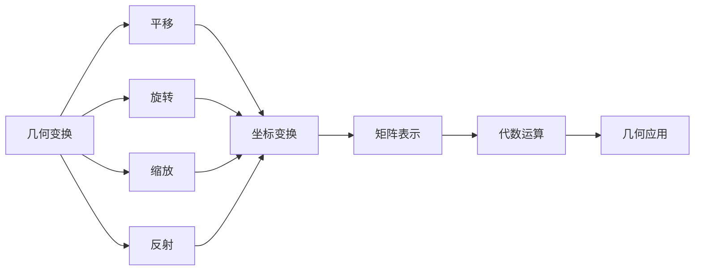
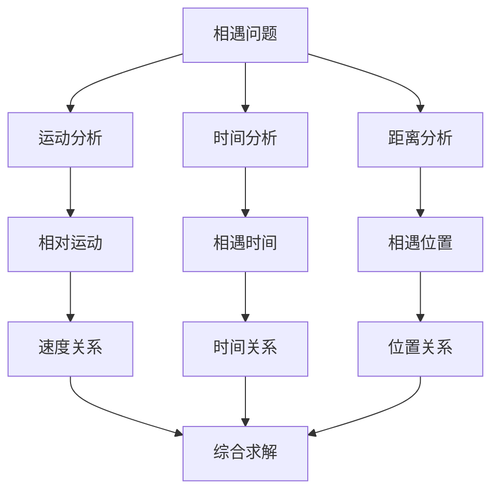
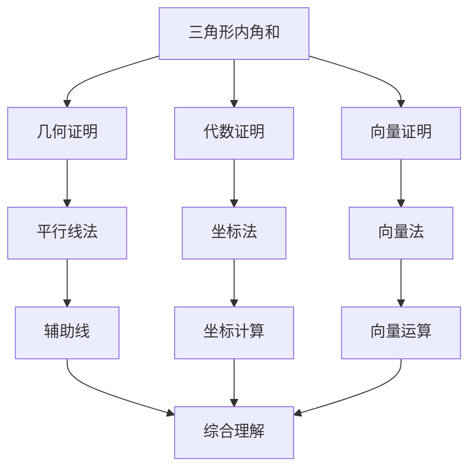
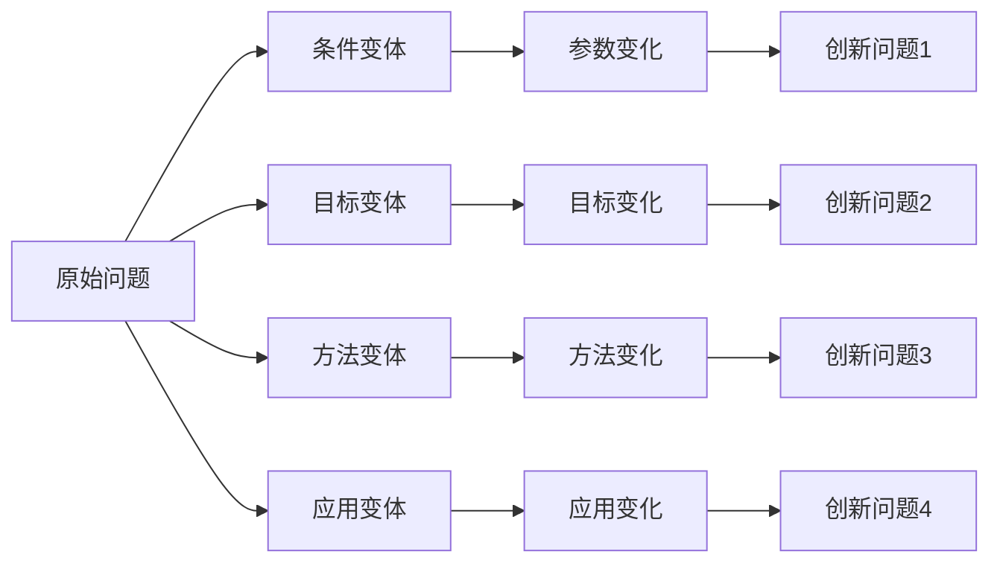
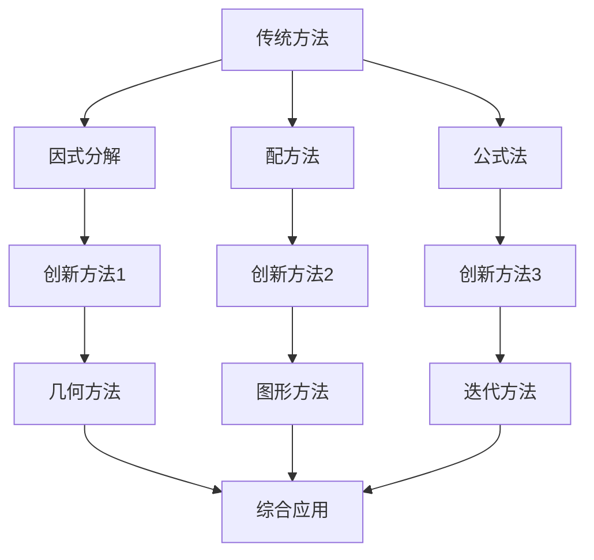
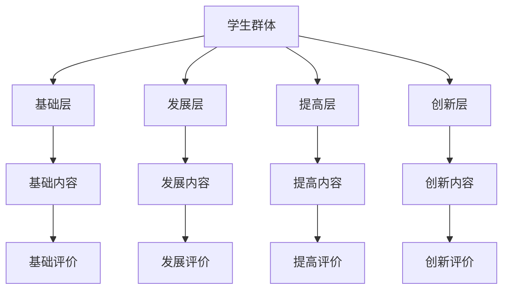
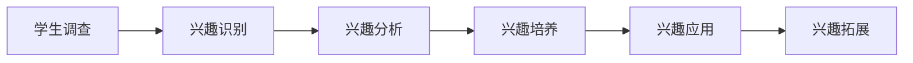
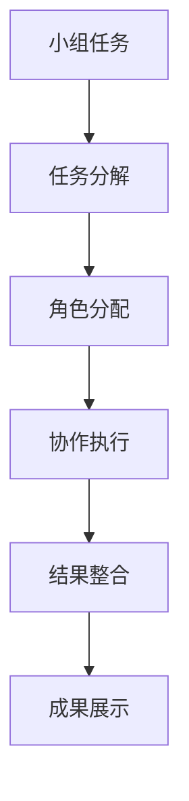
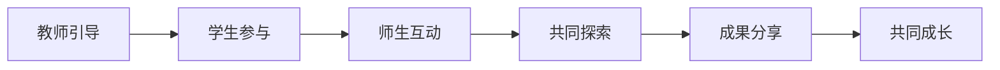
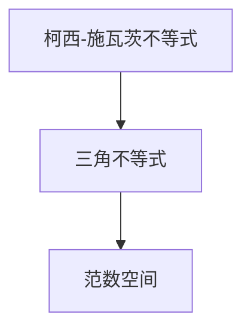

# 数学教学案例集 | Mathematical Teaching Case Collection

## 教学案例总览 | Teaching Case Overview

### 1. 概念关联教学案例 | Concept Connectivity Teaching Cases

#### 1.1 函数概念关联教学案例 | Function Concept Connectivity Teaching Case

**案例背景**：

- **教学目标**：通过函数概念的学习，建立代数、几何、分析之间的联系
- **学生特点**：高中二年级学生，具备基础代数知识
- **教学重点**：函数的多重表征和跨领域应用

**教学流程**：

**第一阶段：概念引入**:

```mermaid
graph TD
    A[函数概念] --> B[代数表征]
    A --> C[几何表征]
    A --> D[分析表征]
    
    B --> E[y = f(x)]
    C --> F[函数图像]
    D --> G[变化率]
    
    E --> H[代数运算]
    F --> I[几何性质]
    G --> J[分析性质]
    
    H --> K[综合应用]
    I --> K
    J --> K
```

**第二阶段：关联建立**:

- **代数与几何关联**：通过函数图像理解代数性质
- **几何与分析关联**：通过切线理解导数概念
- **分析与代数关联**：通过极限理解函数连续性

**第三阶段：应用拓展**:

- **实际问题应用**：用函数建模实际问题
- **跨领域应用**：函数在物理、经济中的应用
- **创新应用**：函数在计算机科学中的应用

**教学效果**：

- 学生能够从多个角度理解函数概念
- 建立了不同数学领域之间的联系
- 提高了问题解决的综合能力

#### 1.2 几何概念关联教学案例 | Geometry Concept Connectivity Teaching Case

**案例背景**：

- **教学目标**：通过几何概念的学习，建立空间思维与代数思维的联系
- **学生特点**：高中三年级学生，具备基础几何知识
- **教学重点**：几何变换与代数变换的统一

**教学流程**：

**第一阶段：基础概念**:



**第二阶段：关联分析**:

- **几何与代数关联**：几何变换的矩阵表示
- **代数与计算关联**：矩阵运算的几何意义
- **计算与应用关联**：计算机图形学中的应用

**第三阶段：综合应用**:

- **计算机辅助设计**：CAD软件中的几何变换
- **动画制作**：动画中的几何变换
- **机器人控制**：机器人运动中的几何变换

**教学效果**：

- 学生理解了几何与代数的深层联系
- 培养了空间思维与代数思维的统一
- 提高了技术应用能力

### 2. 结构性思维教学案例 | Structural Thinking Teaching Cases

#### 2.1 问题结构分析案例 | Problem Structure Analysis Case

**案例背景**：

- **教学目标**：培养学生分析复杂问题结构的能力
- **学生特点**：高中三年级学生，具备较强数学基础
- **教学重点**：问题分解与综合解决

**教学流程**：

**第一阶段：问题呈现**
**问题**：在一个圆形跑道上，甲、乙两人同时从同一点出发，甲沿顺时针方向跑，乙沿逆时针方向跑。甲的速度是乙的2倍，两人第一次相遇时，甲跑了多少圈？

**第二阶段：结构分析**:



**第三阶段：方法选择**:

- **代数方法**：设未知数，列方程
- **几何方法**：利用圆周运动性质
- **物理方法**：利用相对运动概念

**第四阶段：综合解决**:

- **方法整合**：结合多种方法
- **验证结果**：验证解答的正确性
- **方法比较**：比较不同方法的优劣

**教学效果**：

- 学生学会了系统分析问题结构
- 培养了多角度思考问题的能力
- 提高了问题解决的综合能力

#### 2.2 证明结构分析案例 | Proof Structure Analysis Case

**案例背景**：

- **教学目标**：培养学生分析证明结构的能力
- **学生特点**：高中三年级学生，具备基础证明能力
- **教学重点**：证明方法的系统分析

**教学流程**：

**第一阶段：定理呈现**
**定理**：三角形内角和等于180°

**第二阶段：证明结构分析**:



**第三阶段：方法比较**:

- **几何方法**：直观性强，易于理解
- **代数方法**：计算性强，适合复杂问题
- **向量方法**：抽象性强，适合推广

**第四阶段：应用拓展**:

- **平面几何**：多边形内角和
- **立体几何**：多面体性质
- **解析几何**：曲线性质

**教学效果**：

- 学生理解了证明的多种方法
- 培养了证明方法的迁移能力
- 提高了数学思维的灵活性

### 3. 创新思维教学案例 | Innovative Thinking Teaching Cases

#### 3.1 问题创新案例 | Problem Innovation Case

**案例背景**：

- **教学目标**：培养学生发现和创造数学问题的能力
- **学生特点**：高中三年级学生，具备较强数学基础
- **教学重点**：问题创新与变体设计

**教学流程**：

**第一阶段：原始问题**
**问题**：求函数f(x) = x² + 2x + 1的最小值。

**第二阶段：问题变体设计**:



**第三阶段：创新问题示例**:

- **条件变体**：f(x) = ax² + bx + c，讨论参数对最值的影响
- **目标变体**：求函数在区间[a,b]上的最值
- **方法变体**：用导数法、配方法、不等式法求解
- **应用变体**：将问题应用到物理、经济等领域

**第四阶段：创新实践**:

- **学生创新**：学生设计自己的问题变体
- **小组讨论**：小组讨论创新问题
- **全班分享**：全班分享创新成果

**教学效果**：

- 学生学会了问题创新的方法
- 培养了创造性思维能力
- 提高了数学学习的主动性

#### 3.2 方法创新案例 | Method Innovation Case

**案例背景**：

- **教学目标**：培养学生创新数学方法的能力
- **学生特点**：高中三年级学生，具备较强数学基础
- **教学重点**：方法创新与跨领域应用

**教学流程**：

**第一阶段：传统方法**
**问题**：求解二次方程x² - 5x + 6 = 0

**第二阶段：方法创新**:



**第三阶段：创新方法示例**:

- **几何方法**：用抛物线图像求解
- **图形方法**：用函数图像交点求解
- **迭代方法**：用数值迭代求解

**第四阶段：方法评价**:

- **效率比较**：比较不同方法的计算效率
- **适用性分析**：分析不同方法的适用范围
- **创新性评价**：评价方法的创新程度

**教学效果**：

- 学生学会了方法创新的思路
- 培养了创新思维能力
- 提高了问题解决的灵活性

### 4. 个性化教学案例 | Personalized Teaching Cases

#### 4.1 分层教学案例 | Hierarchical Teaching Case

**案例背景**：

- **教学目标**：适应不同学习水平的学生
- **学生特点**：班级学生数学水平差异较大
- **教学重点**：分层教学与个性化指导

**教学流程**：

**第一阶段：学生分层**:



**第二阶段：内容设计**:

- **基础层**：掌握基本概念和方法
- **发展层**：理解概念联系和应用
- **提高层**：掌握高级方法和技巧
- **创新层**：进行创新思维和探索

**第三阶段：方法实施**:

- **分组教学**：按层次分组教学
- **个别指导**：针对个人特点指导
- **动态调整**：根据学习情况调整层次

**第四阶段：效果评价**:

- **分层评价**：针对不同层次进行评价
- **进步评价**：评价学生的进步情况
- **发展评价**：评价学生的发展潜力

**教学效果**：

- 适应了不同学生的学习需求
- 提高了教学的整体效果
- 促进了学生的个性化发展

#### 4.2 兴趣导向案例 | Interest-oriented Case

**案例背景**：

- **教学目标**：激发学生学习数学的兴趣
- **学生特点**：学生对数学缺乏兴趣
- **教学重点**：兴趣培养与动机激发

**教学流程**：

**第一阶段：兴趣调查**:



**第二阶段：兴趣培养**:

- **生活联系**：将数学与生活实际联系
- **游戏设计**：设计数学游戏活动
- **竞赛组织**：组织数学竞赛活动
- **探索活动**：组织数学探索活动

**第三阶段：兴趣应用**:

- **问题设计**：设计学生感兴趣的问题
- **方法选择**：选择学生喜欢的方法
- **活动组织**：组织学生喜欢的活动
- **评价方式**：采用学生喜欢的评价方式

**第四阶段：兴趣拓展**:

- **领域拓展**：拓展到其他数学领域
- **应用拓展**：拓展到实际应用
- **创新拓展**：拓展到创新思维

**教学效果**：

- 激发了学生学习数学的兴趣
- 提高了学生的学习积极性
- 促进了学生的自主学习

### 5. 协作教学案例 | Collaborative Teaching Cases

#### 5.1 小组协作案例 | Group Collaborative Case

**案例背景**：

- **教学目标**：培养学生的协作能力和团队精神
- **学生特点**：学生协作能力有待提高
- **教学重点**：小组协作与团队合作

**教学流程**：

**第一阶段：小组组建**:



**第二阶段：任务设计**:

- **问题设计**：设计需要协作解决的问题
- **角色设计**：设计不同的协作角色
- **评价设计**：设计协作效果的评价方式

**第三阶段：协作实施**:

- **任务分配**：合理分配小组任务
- **过程指导**：指导小组协作过程
- **问题解决**：帮助解决协作中的问题

**第四阶段：成果评价**:

- **协作评价**：评价小组协作效果
- **个人评价**：评价个人在协作中的表现
- **成果评价**：评价小组协作成果

**教学效果**：

- 培养了学生的协作能力
- 提高了学生的团队精神
- 增强了学生的集体智慧

#### 5.2 师生协作案例 | Teacher-Student Collaborative Case

**案例背景**：

- **教学目标**：建立良好的师生关系
- **学生特点**：师生关系有待改善
- **教学重点**：师生协作与共同成长

**教学流程**：

**第一阶段：关系建立**:



**第二阶段：协作设计**:

- **问题设计**：师生共同设计问题
- **方法选择**：师生共同选择方法
- **过程参与**：师生共同参与过程
- **结果评价**：师生共同评价结果

**第三阶段：协作实施**:

- **共同探索**：师生共同探索数学问题
- **相互学习**：师生相互学习
- **共同创新**：师生共同创新
- **共同成长**：师生共同成长

**第四阶段：效果评价**:

- **关系评价**：评价师生关系改善
- **协作评价**：评价师生协作效果
- **成长评价**：评价师生共同成长

**教学效果**：

- 建立了良好的师生关系
- 提高了教学互动性
- 促进了师生共同成长

## 案例评价体系 | Case Evaluation System

### 1. 教学效果评价 | Teaching Effect Evaluation

#### 1.1 知识掌握评价

- **概念理解**：评价学生对概念的理解程度
- **方法掌握**：评价学生对方法的掌握程度
- **应用能力**：评价学生的应用能力
- **综合能力**：评价学生的综合能力

#### 1.2 能力发展评价

- **思维能力**：评价学生思维能力的发展
- **创新能力**：评价学生创新能力的发展
- **协作能力**：评价学生协作能力的发展
- **学习能力**：评价学生学习能力的发展

### 2. 教学方法评价 | Teaching Method Evaluation

#### 2.1 方法适用性评价

- **目标匹配**：评价方法与教学目标的匹配度
- **学生适应**：评价方法对学生的适应性
- **内容适合**：评价方法对内容的适合性
- **效果显著**：评价方法的效果显著性

#### 2.2 方法创新性评价

- **创新程度**：评价方法的创新程度
- **应用价值**：评价方法的应用价值
- **推广可能**：评价方法的推广可能性
- **发展前景**：评价方法的发展前景

### 3. 案例价值评价 | Case Value Evaluation

#### 3.1 教育价值评价

- **教学价值**：评价案例的教学价值
- **学习价值**：评价案例的学习价值
- **发展价值**：评价案例的发展价值
- **创新价值**：评价案例的创新价值

#### 3.2 实践价值评价

- **应用价值**：评价案例的应用价值
- **推广价值**：评价案例的推广价值
- **参考价值**：评价案例的参考价值
- **发展价值**：评价案例的发展价值

## 案例发展展望 | Case Development Prospects

### 1. 技术发展趋势 | Technology Development Trends

#### 1.1 信息技术应用

- **多媒体案例**：开发多媒体教学案例
- **网络案例**：开发网络教学案例
- **智能案例**：开发智能教学案例
- **虚拟案例**：开发虚拟教学案例

#### 1.2 人工智能应用

- **智能诊断**：智能诊断教学问题
- **智能推荐**：智能推荐教学案例
- **智能评价**：智能评价教学效果
- **智能创新**：智能创新教学方法

### 2. 教育发展趋势 | Education Development Trends

#### 2.1 个性化发展

- **个性化案例**：开发个性化教学案例
- **适应性案例**：开发适应性教学案例
- **发展性案例**：开发发展性教学案例
- **创新性案例**：开发创新性教学案例

#### 2.2 协作化发展

- **协作案例**：开发协作教学案例
- **互动案例**：开发互动教学案例
- **共享案例**：开发共享教学案例
- **创新案例**：开发创新教学案例

### 3. 研究发展趋势 | Research Development Trends

#### 3.1 案例研究

- **案例设计**：研究案例设计方法
- **案例实施**：研究案例实施方法
- **案例评价**：研究案例评价方法
- **案例发展**：研究案例发展方向

#### 3.2 教学研究

- **教学理论**：发展教学理论
- **学习理论**：发展学习理论
- **评价理论**：发展评价理论
- **发展理论**：发展发展理论

---

*本教学案例集为SeniorMath项目的核心内容之一，旨在通过具体的教学案例，为数学教育提供实践指导和参考。*

## 8. 现代前沿与跨学科创新教学案例 | Modern Frontier and Interdisciplinary Innovative Teaching Cases

### 8.1 AI与自动化证明教学案例 | AI and Automated Proof Teaching Case

**案例1：AI辅助不等式证明教学 | AI-assisted Inequality Proof Teaching**：

- 利用Lean等自动化证明工具，指导学生形式化证明柯西-施瓦茨不等式，体验AI自动化推理流程。
- Use automated proof tools such as Lean to guide students in formalizing and proving the Cauchy-Schwarz inequality, experiencing AI automated reasoning processes.
- 【Lean形式化】

```lean
import data.real.basic
example (a b : ℝ) : 2 * a * b ≤ a^2 + b^2 :=
begin
  have h : (a - b)^2 ≥ 0 := sq_nonneg (a - b),
  linarith,
end
```

### 8.2 知识图谱与可视化教学案例 | Knowledge Graphs and Visual Teaching Case

**案例2：知识图谱驱动的定理教学 | Theorem Teaching Driven by Knowledge Graphs**：

- 构建定理、引理、定义、方法之间的知识图谱，辅助学生理解复杂定理的结构与应用。
- Build knowledge graphs linking theorems, lemmas, definitions, and methods to help students understand the structure and application of complex theorems.
- 【Mermaid知识图谱示例】



### 8.3 跨学科AI建模教学案例 | Interdisciplinary AI Modeling Teaching Case

**案例3：AI驱动的现实系统建模教学 | AI-driven Real-world System Modeling Teaching**：

- 利用AI算法对交通流、生态系统等复杂系统进行建模，指导学生分析变量、结构、优化理论基础。
- Use AI algorithms to model complex systems such as traffic flow and ecosystems, guiding students to analyze variables, structure, and optimization theory.

### 8.4 脑科学与认知教学案例 | Neuroscience and Cognitive Teaching Case

**案例4：脑科学视角下的数学认知教学 | Mathematical Cognition Teaching from Neuroscience Perspective**：

- 结合脑成像实验，分析不同数学任务激活的脑区差异，优化认知策略与教学方法。
- Combine brain imaging experiments to analyze brain region activation differences for different mathematical tasks, optimizing cognitive strategies and teaching methods.

### 8.5 哲学与自动化证明教学案例 | Philosophy and Automated Proof Teaching Case

**案例5：多哲学流派下的自动化证明教学 | Automated Proof Teaching under Multiple Philosophical Schools**：

- 分析形式主义、结构主义、直觉主义等流派对自动化证明教学的影响，设计多元真理观下的教学流程。
- Analyze the impact of formalism, structuralism, intuitionism, etc., on automated proof teaching, and design teaching processes under pluralistic views of truth.

### 8.6 可视化表达与创新教学案例 | Visualization and Innovative Teaching Case

**案例6：复杂结构的可视化创新教学 | Innovative Teaching of Visualizing Complex Structures**：

- 针对高维多面体、分形、网络等复杂结构，设计可视化教学方案，结合AI/知识图谱/交互式工具，提升认知与创新能力。
- For complex structures such as high-dimensional polytopes, fractals, networks, design visual teaching schemes, combine AI/knowledge graphs/interactive tools to enhance cognition and innovation.

> 本节案例持续递归扩展，结合AI、知识图谱、自动化证明、脑科学、可视化等前沿，突出数学教学的创新性、国际化与多学科融合。
> This section of cases will be recursively expanded, integrating AI, knowledge graphs, automated proof, neuroscience, visualization, etc., highlighting the innovation, internationalization, and interdisciplinary integration of mathematics teaching.
