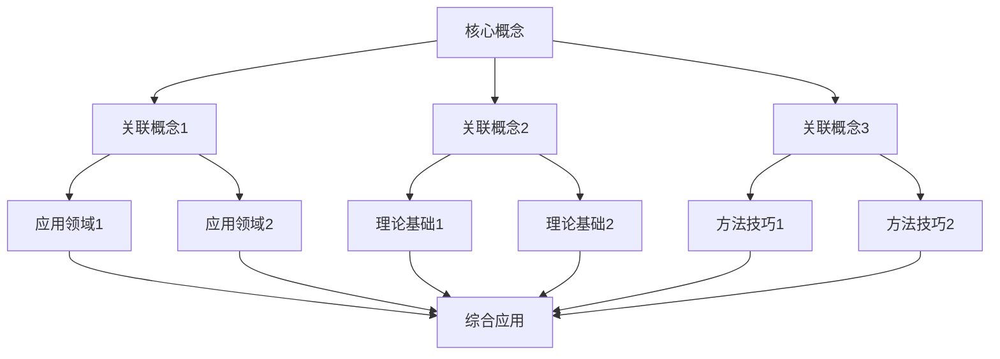
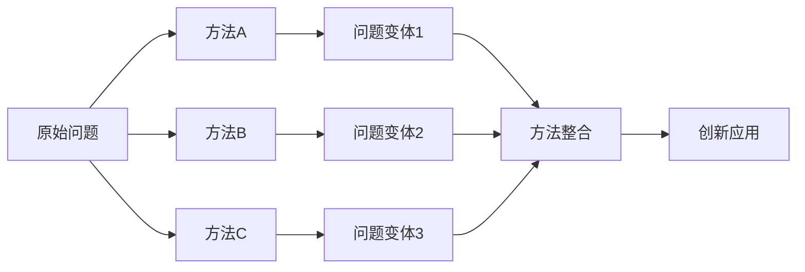
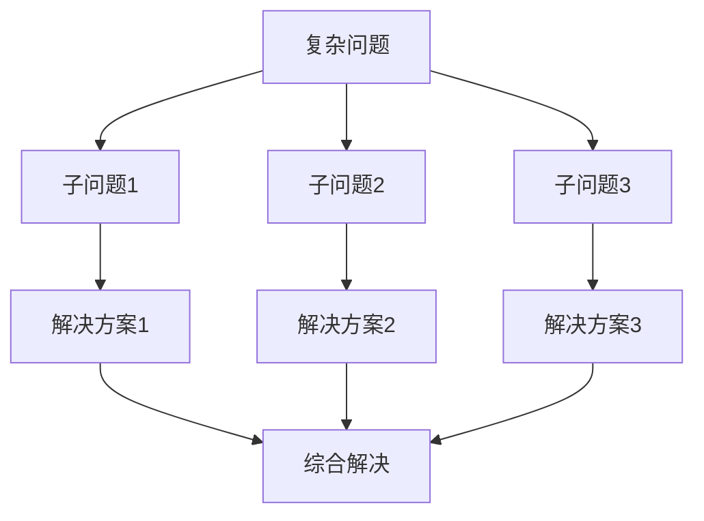
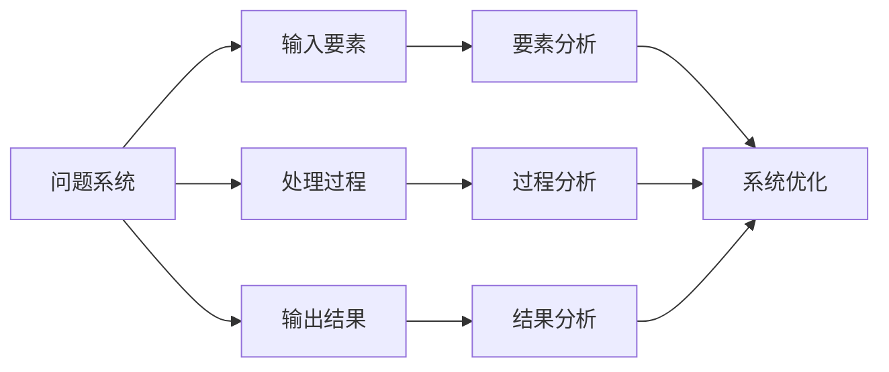
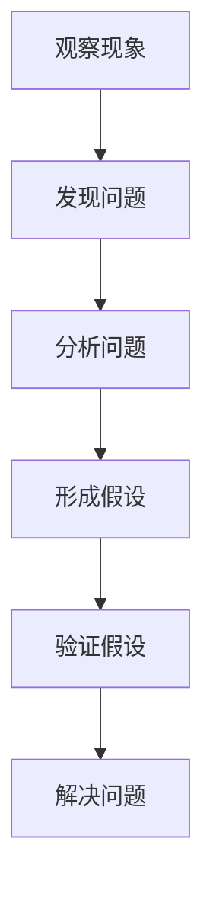
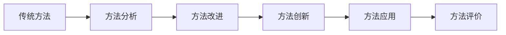
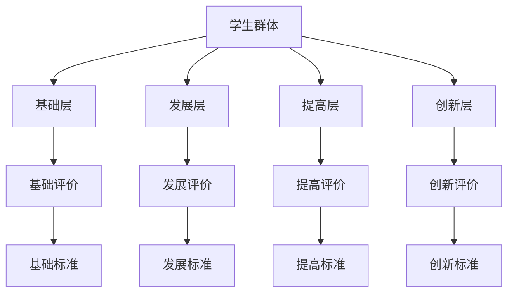
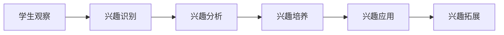
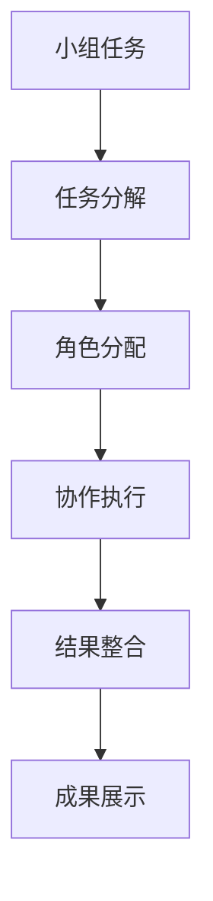
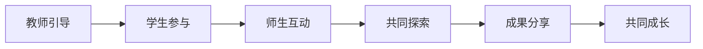

# 数学教学评价体系 | Mathematical Teaching Evaluation System

## 评价体系总览 | Evaluation System Overview

### 1. 知识关联性评价 | Knowledge Connectivity Evaluation

#### 1.1 概念关联评价 | Concept Connectivity Evaluation

**评价目标**：

- 评价学生对数学概念之间关联的理解
- 评价学生建立知识网络的能力
- 评价学生跨领域应用概念的能力
- 评价学生概念迁移的能力

**评价方法**：

**方法一：概念地图评价**:

**评价指标**：

- **关联广度**：概念关联的数量和范围
- **关联深度**：概念关联的层次和深度
- **关联准确性**：概念关联的正确性
- **关联创新性**：概念关联的创新程度

**方法二：跨领域应用评价**:

- **领域识别**：识别概念在不同领域的应用
- **方法迁移**：评价方法在不同领域的迁移能力
- **问题综合**：评价解决综合性问题的能力
- **创新应用**：评价创新性应用概念的能力

#### 1.2 方法关联评价 | Method Connectivity Evaluation

**评价目标**：

- 评价学生对数学方法之间关联的理解
- 评价学生方法迁移的能力
- 评价学生方法整合的能力
- 评价学生创新方法的能力

**评价方法**：

**方法一：方法迁移评价**:

**评价指标**：

- **迁移准确性**：方法迁移的正确性
- **迁移灵活性**：方法迁移的灵活性
- **迁移创新性**：方法迁移的创新性
- **迁移效果**：方法迁移的效果

**方法二：方法整合评价**:

- **方法选择**：选择合适方法的能力
- **方法组合**：组合不同方法的能力
- **方法创新**：创新方法的能力
- **方法评价**：评价方法效果的能力

### 2. 结构性思维评价 | Structural Thinking Evaluation

#### 2.1 结构分析评价 | Structural Analysis Evaluation

**评价目标**：

- 评价学生分析问题结构的能力
- 评价学生分解复杂问题的能力
- 评价学生识别问题模式的能力
- 评价学生构建问题框架的能力

**评价方法**：

**方法一：问题结构分析评价**:

**评价指标**：

- **分解准确性**：问题分解的准确性
- **分解完整性**：问题分解的完整性
- **分解层次性**：问题分解的层次性
- **分解创新性**：问题分解的创新性

**方法二：模式识别评价**:

- **模式发现**：发现问题模式的能力
- **模式分析**：分析模式特征的能力
- **模式应用**：应用模式解决问题的能力
- **模式创新**：创新模式应用的能力

#### 2.2 系统思维评价 | Systematic Thinking Evaluation

**评价目标**：

- 评价学生系统思维能力
- 评价学生整体把握能力
- 评价学生协调性思维
- 评价学生整合能力

**评价方法**：

**方法一：系统建模评价**:

**评价指标**：

- **系统理解**：对系统整体的理解
- **要素分析**：对系统要素的分析
- **关系把握**：对要素关系的把握
- **系统优化**：对系统的优化能力

**方法二：整体分析评价**:

- **整体把握**：从整体角度把握问题
- **要素分析**：分析系统各要素
- **关系分析**：分析要素间关系
- **协调优化**：协调优化系统

### 3. 创新思维评价 | Innovative Thinking Evaluation

#### 3.1 问题创新评价 | Problem Innovation Evaluation

**评价目标**：

- 评价学生发现问题的能力
- 评价学生分析问题的能力
- 评价学生创新问题的能力
- 评价学生解决创新问题的能力

**评价方法**：

**方法一：问题发现评价**:

**评价指标**：

- **观察敏锐性**：观察现象的敏锐性
- **问题识别**：识别问题的能力
- **假设形成**：形成合理假设的能力
- **验证能力**：验证假设的能力

**方法二：问题创新评价**:

- **问题变体**：设计问题变体的能力
- **问题组合**：组合不同问题的能力
- **问题拓展**：拓展问题应用的能力
- **问题创新**：创新问题设计的能力

#### 3.2 方法创新评价 | Method Innovation Evaluation

**评价目标**：

- 评价学生创新方法的能力
- 评价学生方法应用的能力
- 评价学生方法迁移的能力
- 评价学生方法整合的能力

**评价方法**：

**方法一：方法创新评价**:

**评价指标**：

- **方法分析**：分析传统方法的能力
- **方法改进**：改进传统方法的能力
- **方法创新**：创新方法的能力
- **方法应用**：应用创新方法的能力

**方法二：跨领域应用评价**:

- **领域迁移**：将方法迁移到不同领域
- **方法整合**：整合不同领域的方法
- **创新应用**：创新性地应用方法
- **效果评价**：评价应用效果的能力

### 4. 个性化评价 | Personalized Evaluation

#### 4.1 分层评价 | Hierarchical Evaluation

**评价目标**：

- 适应不同学习水平的学生
- 满足不同学习需求的学生
- 促进个性化发展
- 提高评价效果

**评价方法**：

**方法一：能力分层评价**:

**评价指标**：

- **基础掌握**：基础知识的掌握程度
- **发展能力**：能力发展的程度
- **提高水平**：水平提高的程度
- **创新能力**：创新能力的程度

**方法二：内容分层评价**:

- **基础内容**：基础内容的掌握
- **发展内容**：发展内容的掌握
- **提高内容**：提高内容的掌握
- **创新内容**：创新内容的掌握

#### 4.2 兴趣导向评价 | Interest-oriented Evaluation

**评价目标**：

- 激发学习兴趣
- 保持学习动机
- 提高学习效果
- 促进自主学习

**评价方法**：

**方法一：兴趣发展评价**:

**评价指标**：

- **兴趣识别**：识别学生兴趣的能力
- **兴趣分析**：分析兴趣特征的能力
- **兴趣培养**：培养学习兴趣的能力
- **兴趣应用**：应用兴趣学习的能力

**方法二：动机评价**:

- **动机强度**：学习动机的强度
- **动机稳定性**：学习动机的稳定性
- **动机方向**：学习动机的方向
- **动机效果**：学习动机的效果

### 5. 协作评价 | Collaborative Evaluation

#### 5.1 小组协作评价 | Group Collaborative Evaluation

**评价目标**：

- 评价学生的协作能力
- 评价学生的交流能力
- 评价学生的团队精神
- 评价学生的集体智慧

**评价方法**：

**方法一：协作过程评价**:

**评价指标**：

- **任务分解**：分解任务的能力
- **角色分配**：分配角色的能力
- **协作执行**：执行协作的能力
- **结果整合**：整合结果的能力

**方法二：协作效果评价**:

- **协作效率**：协作的效率
- **协作质量**：协作的质量
- **协作创新**：协作的创新性
- **协作满意度**：协作的满意度

#### 5.2 师生协作评价 | Teacher-Student Collaborative Evaluation

**评价目标**：

- 评价师生关系
- 评价教学互动
- 评价共同成长
- 评价教学效果

**评价方法**：

**方法一：互动评价**:

**评价指标**：

- **引导效果**：教师引导的效果
- **参与程度**：学生参与的程度
- **互动质量**：师生互动的质量
- **探索深度**：共同探索的深度

**方法二：成长评价**:

- **教师成长**：教师的专业成长
- **学生成长**：学生的能力成长
- **关系发展**：师生关系的发展
- **教学改进**：教学方法的改进

## 评价工具设计 | Evaluation Tool Design

### 1. 形成性评价工具 | Formative Evaluation Tools

#### 1.1 观察记录工具

- **行为观察**：观察学生的学习行为
- **过程记录**：记录学习过程
- **问题分析**：分析学习中的问题
- **改进建议**：提出改进建议

#### 1.2 访谈工具

- **深度访谈**：进行深度访谈了解学生
- **焦点访谈**：进行焦点访谈了解问题
- **反馈访谈**：进行反馈访谈了解效果
- **发展访谈**：进行发展访谈了解需求

### 2. 总结性评价工具 | Summative Evaluation Tools

#### 2.1 测试工具

- **知识测试**：测试知识掌握程度
- **能力测试**：测试能力发展程度
- **应用测试**：测试应用能力程度
- **创新测试**：测试创新能力程度

#### 2.2 作品评价工具

- **作品分析**：分析学生作品
- **作品比较**：比较不同作品
- **作品评价**：评价作品质量
- **作品改进**：提出改进建议

### 3. 发展性评价工具 | Developmental Evaluation Tools

#### 3.1 档案袋评价

- **学习档案**：建立学习档案
- **成长记录**：记录成长过程
- **成果展示**：展示学习成果
- **反思总结**：进行反思总结

#### 3.2 自我评价工具

- **自我反思**：进行自我反思
- **自我评价**：进行自我评价
- **自我改进**：进行自我改进
- **自我发展**：促进自我发展

## 评价标准设计 | Evaluation Standard Design

### 1. 知识标准 | Knowledge Standards

#### 1.1 概念理解标准

- **理解深度**：概念理解的深度
- **理解广度**：概念理解的广度
- **理解准确性**：概念理解的准确性
- **理解应用性**：概念理解的应用性

#### 1.2 方法掌握标准

- **掌握程度**：方法掌握的程度
- **应用能力**：方法应用的能力
- **迁移能力**：方法迁移的能力
- **创新能力**：方法创新的能力

### 2. 能力标准 | Ability Standards

#### 2.1 思维能力标准

- **逻辑思维**：逻辑思维的能力
- **创新思维**：创新思维的能力
- **批判思维**：批判思维的能力
- **系统思维**：系统思维的能力

#### 2.2 应用能力标准

- **问题解决**：问题解决的能力
- **实际应用**：实际应用的能力
- **跨领域应用**：跨领域应用的能力
- **创新应用**：创新应用的能力

### 3. 发展标准 | Development Standards

#### 3.1 学习发展标准

- **学习动机**：学习动机的发展
- **学习策略**：学习策略的发展
- **学习效果**：学习效果的发展
- **学习能力**：学习能力的发展

#### 3.2 个性发展标准

- **兴趣发展**：兴趣的发展
- **特长发展**：特长的发展
- **潜能发展**：潜能的发展
- **创新发展**：创新精神的发展

## 评价实施策略 | Evaluation Implementation Strategy

### 1. 评价计划制定 | Evaluation Plan Development

#### 1.1 目标设定

- **评价目标**：明确评价目标
- **评价内容**：确定评价内容
- **评价方法**：选择评价方法
- **评价标准**：制定评价标准

#### 1.2 计划实施

- **时间安排**：合理安排评价时间
- **人员分工**：合理分工评价人员
- **资源准备**：准备评价资源
- **过程监控**：监控评价过程

### 2. 评价过程管理 | Evaluation Process Management

#### 2.1 过程控制

- **质量控制**：控制评价质量
- **进度控制**：控制评价进度
- **成本控制**：控制评价成本
- **风险控制**：控制评价风险

#### 2.2 结果处理

- **结果分析**：分析评价结果
- **结果反馈**：反馈评价结果
- **结果应用**：应用评价结果
- **结果改进**：改进评价方法

### 3. 评价质量保证 | Evaluation Quality Assurance

#### 3.1 质量监控

- **标准监控**：监控评价标准
- **过程监控**：监控评价过程
- **结果监控**：监控评价结果
- **改进监控**：监控改进效果

#### 3.2 质量改进

- **问题识别**：识别评价问题
- **原因分析**：分析问题原因
- **改进措施**：制定改进措施
- **效果验证**：验证改进效果

## 评价发展展望 | Evaluation Development Prospects

### 1. 技术发展趋势 | Technology Development Trends

#### 1.1 信息技术应用

- **计算机评价**：利用计算机进行评价
- **网络评价**：利用网络进行评价
- **智能评价**：利用智能技术进行评价
- **虚拟评价**：利用虚拟技术进行评价

#### 1.2 人工智能应用

- **智能诊断**：智能诊断学习问题
- **智能评价**：智能评价学习效果
- **智能推荐**：智能推荐学习内容
- **智能辅导**：智能辅导学习过程

### 2. 教育发展趋势 | Education Development Trends

#### 2.1 个性化发展

- **个性化评价**：根据个人特点进行评价
- **适应性评价**：根据学习情况调整评价
- **发展性评价**：促进学生发展的评价
- **创新性评价**：培养创新能力的评价

#### 2.2 协作化发展

- **协作评价**：通过协作进行评价
- **互动评价**：具有互动性的评价
- **共享评价**：可以共享的评价资源
- **创新评价**：促进创新的评价

### 3. 研究发展趋势 | Research Development Trends

#### 3.1 评价研究

- **评价理论**：发展评价理论
- **评价方法**：发展评价方法
- **评价工具**：发展评价工具
- **评价标准**：发展评价标准

#### 3.2 教育研究

- **教学理论**：发展教学理论
- **学习理论**：发展学习理论
- **发展理论**：发展发展理论
- **创新理论**：发展创新理论

---

*本教学评价体系为SeniorMath项目的核心内容之一，旨在通过系统化的评价体系，为数学教育提供科学、完整、实用的评价指导。*
