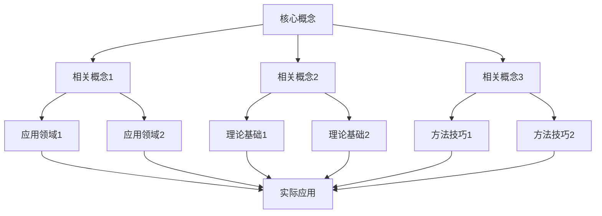
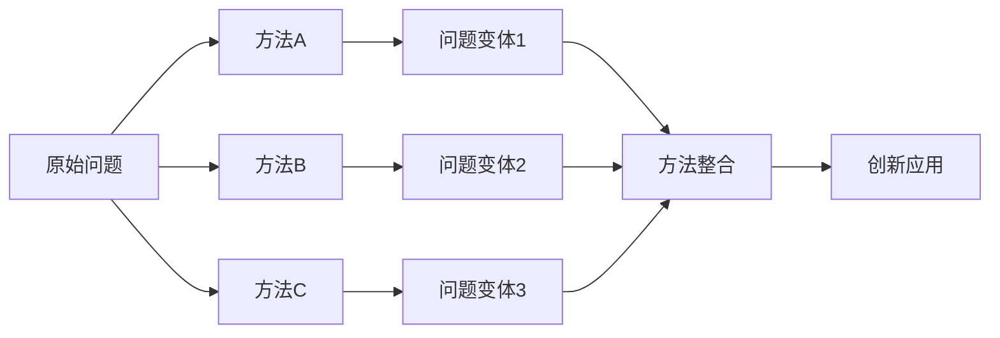

# 数学教学策略集 | Mathematical Teaching Strategy Collection

## 1. 教学策略总览 | Teaching Strategy Overview

### 1.1 知识关联性教学策略 | Knowledge Connectivity Teaching Strategies

#### 1.1.1 概念关联教学策略 | Concept Connectivity Teaching Strategy

**策略目标**：

- 建立数学概念之间的关联
- 形成完整的知识网络
- 提高概念理解深度
- 培养关联思维能力

**实施方法**：

**方法一：概念地图法**:



**方法二：对比分析法**:

- **相似性对比**：比较相似概念的联系
- **差异性对比**：比较不同概念的区别
- **层次性对比**：比较概念的不同层次
- **发展性对比**：比较概念的发展过程

**方法三：递进关联法**:

- **基础关联**：从基础概念开始建立关联
- **扩展关联**：逐步扩展到相关概念
- **深化关联**：深入分析概念间的深层联系
- **应用关联**：将概念关联应用到实际问题

#### 1.1.2 方法关联教学策略 | Method Connectivity Teaching Strategy

**策略目标**：

- 建立数学方法之间的关联
- 形成方法迁移能力
- 提高方法应用灵活性
- 培养创新思维能力

**实施方法**：

**方法一：方法迁移法**:



**方法二：问题驱动法**:

- **问题分析**：分析问题的结构和特点
- **方法选择**：选择合适的方法
- **方法应用**：应用方法解决问题
- **方法评价**：评价方法的效果

**方法三：创新应用法**:

- **方法创新**：创新数学方法
- **应用创新**：创新应用领域
- **组合创新**：组合不同方法
- **拓展创新**：拓展方法应用范围

### 1.2 思维培养教学策略 | Thinking Development Teaching Strategies

#### 1.2.1 逻辑思维培养策略 | Logical Thinking Development Strategy

**策略目标**：

- 培养严谨的逻辑推理能力
- 提高数学证明能力
- 发展批判性思维
- 增强问题分析能力

**实施方法**：

**方法一：证明训练法**:

- **直接证明**：从已知条件直接推导结论
- **反证法**：假设结论不成立，推导矛盾
- **数学归纳法**：证明递推关系的正确性
- **构造法**：构造满足条件的对象

**方法二：问题分析法**:

- **问题分解**：将复杂问题分解为简单子问题
- **条件分析**：分析已知条件和隐含条件
- **目标明确**：明确要解决的问题和目标
- **策略选择**：选择合适的解题策略

#### 1.2.2 创新思维培养策略 | Innovative Thinking Development Strategy

**策略目标**：

- 培养数学创新思维
- 提高问题解决能力
- 发展创造性思维
- 增强数学直觉

**实施方法**：

**方法一：开放性问题法**:

- **多解问题**：鼓励寻找多种解题方法
- **开放性问题**：没有标准答案的数学问题
- **探究性问题**：引导学生自主探究的问题
- **创新性问题**：需要创新思维的问题

**方法二：数学建模法**:

- **实际问题建模**：将实际问题转化为数学问题
- **模型构建**：构建合适的数学模型
- **模型求解**：求解数学模型
- **结果验证**：验证模型结果的合理性

### 1.3 能力培养教学策略 | Ability Development Teaching Strategies

#### 1.3.1 计算能力培养策略 | Computational Ability Development Strategy

**策略目标**：

- 提高计算速度和准确性
- 培养计算技巧
- 发展估算能力
- 增强计算思维

**实施方法**：

**方法一：技巧训练法**:

- **速算技巧**：训练快速计算技巧
- **估算方法**：培养估算能力
- **计算策略**：选择合适的计算策略
- **错误分析**：分析计算错误的原因

**方法二：工具应用法**:

- **计算器使用**：合理使用计算器
- **软件应用**：使用数学软件进行计算
- **编程计算**：使用编程语言进行计算
- **在线工具**：利用在线计算工具

#### 1.3.2 应用能力培养策略 | Application Ability Development Strategy

**策略目标**：

- 培养数学应用能力
- 提高实际问题解决能力
- 发展跨学科应用能力
- 增强数学建模能力

**实施方法**：

**方法一：实际问题法**:

- **生活问题**：解决生活中的数学问题
- **科学问题**：解决科学中的数学问题
- **工程问题**：解决工程中的数学问题
- **经济问题**：解决经济中的数学问题

**方法二：项目学习法**:

- **项目设计**：设计数学应用项目
- **项目实施**：实施数学应用项目
- **项目评价**：评价项目成果
- **项目展示**：展示项目成果

## 2. AI驱动的教学创新策略

### 2.1 智能教学助手应用

#### 2.1.1 基于学习数据的个性化教学方案设计

**策略描述**：
利用AI技术分析学生的学习数据，为每个学生设计个性化的教学方案。

**实施步骤**：
1. **数据收集**：收集学习时间、答题正确率、知识点掌握情况
2. **模式分析**：分析学习偏好、薄弱环节、进步趋势
3. **方案生成**：生成学习路径、习题推荐、教学方法
4. **动态调整**：根据学习效果实时调整教学策略

**AI工具应用**：
- **ChatGPT**：个性化内容生成
- **机器学习算法**：学习模式识别
- **数据分析工具**：学习效果评估

#### 2.1.2 智能推荐学习路径

**策略描述**：
基于学生的学习历史和能力水平，智能推荐最适合的学习路径。

**推荐算法**：
```python
def recommend_learning_path(student_profile):
    # 分析学生能力水平
    skill_level = analyze_skill_level(student_profile)
    # 识别知识缺口
    knowledge_gaps = identify_gaps(student_profile)
    # 生成推荐路径
    learning_path = generate_path(skill_level, knowledge_gaps)
    return learning_path
```

**推荐维度**：
- **知识点顺序**：合理安排知识点学习顺序
- **习题难度**：根据学生水平推荐合适难度
- **学习方法**：推荐适合的学习方法
- **时间安排**：合理安排学习时间

#### 2.1.3 AI辅助教学诊断

**策略描述**：
使用AI技术诊断学生的学习问题，提供针对性的教学建议。

**诊断内容**：
- **知识掌握程度**：评估学生对各知识点的掌握情况
- **解题思维过程**：分析学生的解题思维过程
- **错误模式分析**：识别学生的常见错误模式
- **学习困难识别**：识别学生的学习困难点

**诊断方法**：
- **答题数据分析**：分析学生的答题数据
- **思维过程追踪**：追踪学生的思维过程
- **错误模式识别**：识别学生的错误模式
- **学习行为分析**：分析学生的学习行为

#### 2.1.4 智能教学评价

**策略描述**：
建立基于AI的智能教学评价系统，实时分析学习效果并调整教学策略。

**评价维度**：
- **知识掌握评价**：评价学生对知识的掌握程度
- **能力发展评价**：评价学生能力的发展情况
- **学习态度评价**：评价学生的学习态度
- **创新思维评价**：评价学生的创新思维能力

**评价方法**：
- **多维度评估**：从多个维度进行评估
- **动态跟踪**：动态跟踪学生的学习情况
- **个性化反馈**：提供个性化的反馈
- **预测性分析**：预测学生的学习发展趋势

### 2.2 AI自动化教学工具

#### 2.2.1 ChatGPT辅助数学概念解释

**策略描述**：
使用ChatGPT等AI工具辅助数学概念的解释和说明。

**应用场景**：
- **复杂概念简化**：将复杂概念简化为易于理解的形式
- **多角度解释**：从多个角度解释数学概念
- **实例化说明**：通过具体实例说明抽象概念
- **类比教学**：使用类比方法解释数学概念

**使用技巧**：
- **明确提问要求**：明确向AI提出的问题要求
- **提供具体背景**：为AI提供具体的背景信息
- **要求多角度解释**：要求AI从多个角度进行解释
- **验证解释准确性**：验证AI解释的准确性

#### 2.2.2 Lean和Coq辅助证明验证

**策略描述**：
使用Lean、Coq等形式化证明工具辅助数学证明的验证。

**应用领域**：
- **几何证明验证**：验证几何定理的证明
- **代数证明检查**：检查代数定理的证明
- **分析证明验证**：验证分析定理的证明
- **逻辑推理训练**：训练逻辑推理能力

**实施方法**：
- **学习形式化语言**：学习形式化证明语言
- **编写证明代码**：编写形式化证明代码
- **验证证明正确性**：验证证明的正确性
- **改进证明方法**：改进证明方法

#### 2.2.3 Wolfram Alpha和GeoGebra AI辅助计算

**策略描述**：
使用Wolfram Alpha、GeoGebra AI等工具辅助数学计算和可视化。

**功能应用**：
- **复杂计算求解**：求解复杂的数学计算问题
- **图形绘制展示**：绘制和展示数学图形
- **数值分析计算**：进行数值分析计算
- **几何问题解决**：解决几何问题

**教学应用**：
- **计算验证**：验证计算结果的正确性
- **图形演示**：演示数学概念和过程
- **参数探索**：探索参数对结果的影响
- **结果分析**：分析计算结果

#### 2.2.4 AI生成个性化习题

**策略描述**：
使用AI技术生成适合学生水平的个性化习题。

**生成方法**：
- **基于知识图谱生成**：基于知识图谱生成习题
- **根据难度要求生成**：根据难度要求生成习题
- **结合学生特点生成**：结合学生特点生成习题
- **融入创新元素生成**：融入创新元素生成习题

**习题类型**：
- **基础练习**：基础知识和技能的练习
- **提高练习**：提高能力的练习
- **创新练习**：培养创新思维的练习
- **综合应用**：综合应用能力的练习

## 3. 国际化教学创新策略

### 3.1 多语种教学策略

#### 3.1.1 多语种数学教材设计

**策略描述**：
设计支持多语种的数学教材和教学资源。

**设计原则**：
- **语言对照清晰**：不同语言之间的对照清晰明确
- **概念表达准确**：数学概念的表达准确无误
- **文化背景融合**：融合不同文化的背景
- **学习路径明确**：明确的学习路径和步骤

**教材结构**：
- **中英对照版本**：中文和英文对照版本
- **德法补充版本**：德语和法语补充版本
- **文化背景说明**：不同文化背景的说明
- **国际标准对齐**：与国际标准的对齐

#### 3.1.2 多语种数学表达训练

**策略描述**：
培养学生掌握多语种数学表达的能力。

**训练内容**：
- **术语对照学习**：学习不同语言的数学术语对照
- **概念对比分析**：对比分析不同语言的概念表达
- **文化背景理解**：理解不同文化的背景
- **国际交流能力**：培养国际交流能力

**训练方法**：
- **术语对照学习**：系统学习数学术语的多语言对照
- **概念对比分析**：对比分析不同语言的概念表达差异
- **文化背景介绍**：介绍不同文化的数学发展背景
- **国际交流实践**：进行国际交流实践

#### 3.1.3 多语种数学交流活动

**策略描述**：
组织多语种数学交流活动，培养学生的国际交流能力。

**活动形式**：
- **国际数学竞赛**：参加国际数学竞赛
- **跨文化数学讨论**：进行跨文化数学讨论
- **多语种数学展示**：进行多语种数学展示
- **国际合作项目**：参与国际合作项目

**活动目标**：
- **提升语言能力**：提升多语言表达能力
- **增强文化理解**：增强对不同文化的理解
- **培养国际视野**：培养国际视野和跨文化理解能力
- **促进学术交流**：促进国际学术交流

### 3.2 跨文化数学教学策略

#### 3.2.1 不同文化数学发展历史融入

**策略描述**：
将不同文化的数学发展历史融入数学教学。

**文化主题**：
- **中国古代数学**：算筹、九章算术、圆周率
- **希腊古典数学**：欧几里得几何、毕达哥拉斯定理
- **阿拉伯数学**：代数学、三角学、算法
- **印度数学**：零的概念、十进制、三角函数

**教学方法**：
- **历史背景介绍**：介绍不同文化的数学发展历史背景
- **文化特色分析**：分析不同文化的数学特色
- **数学思想对比**：对比不同文化的数学思想
- **现代应用展示**：展示数学在现代的应用

#### 3.2.2 跨文化数学思维特点分析

**策略描述**：
分析不同文化背景下的数学思维特点。

**思维特点**：
- **中国数学**：实用性强、算法丰富
- **希腊数学**：逻辑严密、证明严谨
- **阿拉伯数学**：符号化、系统化
- **印度数学**：抽象思维、创新性强

**分析维度**：
- **思维方式差异**：分析不同文化的思维方式差异
- **问题解决方法**：分析不同文化的问题解决方法
- **数学表达习惯**：分析不同文化的数学表达习惯
- **创新思维特点**：分析不同文化的创新思维特点

#### 3.2.3 跨文化数学问题设计

**策略描述**：
设计体现不同文化背景的数学问题。

**问题类型**：
- **文化背景问题**：体现文化背景的数学问题
- **历史发展问题**：体现历史发展的数学问题
- **应用场景问题**：体现应用场景的数学问题
- **思维方法问题**：体现思维方法的数学问题

**设计原则**：
- **文化特色鲜明**：体现鲜明的文化特色
- **数学原理清晰**：数学原理清晰明确
- **应用价值突出**：突出应用价值
- **教育意义深刻**：具有深刻的教育意义

## 4. 跨学科教学创新策略

### 4.1 数学与AI融合教学策略

#### 4.1.1 线性代数在机器学习中的应用

**策略描述**：
展示线性代数在机器学习中的核心应用。

**应用领域**：
- **主成分分析(PCA)**：降维技术
- **奇异值分解(SVD)**：矩阵分解
- **特征向量和特征值**：数据变换
- **矩阵分解**：推荐系统

**教学方法**：
- **理论讲解**：讲解线性代数的理论基础
- **实例演示**：演示具体的应用实例
- **算法实现**：实现相关算法
- **应用分析**：分析应用效果

#### 4.1.2 概率统计在深度学习中的作用

**策略描述**：
说明概率统计在深度学习中的重要作用。

**统计概念**：
- **贝叶斯定理**：概率推理
- **最大似然估计**：参数估计
- **信息论**：信息度量
- **随机过程**：时间序列

**教学应用**：
- **概念解释**：解释统计概念
- **实例分析**：分析具体实例
- **算法演示**：演示相关算法
- **应用实践**：进行应用实践

#### 4.1.3 优化理论在神经网络训练中的体现

**策略描述**：
解释优化理论在神经网络训练中的体现。

**优化方法**：
- **梯度下降**：参数更新
- **随机梯度下降**：在线学习
- **动量法**：加速收敛
- **自适应学习率**：动态调整

**教学重点**：
- **优化原理**：讲解优化原理
- **算法实现**：实现相关算法
- **收敛分析**：分析收敛性
- **应用效果**：分析应用效果

#### 4.1.4 图论在知识图谱构建中的应用

**策略描述**：
介绍图论在知识图谱构建中的应用。

**图论应用**：
- **图结构设计**：节点和边
- **路径分析**：知识关联
- **社区检测**：知识聚类
- **中心性分析**：重要性评估

**教学实践**：
- **图论基础**：讲解图论基础
- **算法实现**：实现相关算法
- **应用分析**：分析应用效果
- **创新设计**：进行创新设计

### 4.2 数学与脑科学融合教学策略

#### 4.2.1 数字处理的脑区定位和机制

**策略描述**：
介绍数字处理的脑区定位和机制。

**脑区功能**：
- **顶叶**：空间数字处理
- **颞叶**：数字识别
- **额叶**：数字运算
- **枕叶**：视觉数字处理

**教学应用**：
- **认知机制讲解**：讲解认知机制
- **实验设计分析**：分析实验设计
- **教学策略优化**：优化教学策略
- **个性化指导**：进行个性化指导

#### 4.2.2 空间思维的神经基础和过程

**策略描述**：
解释空间思维的神经基础和过程。

**神经机制**：
- **视觉空间处理**：空间感知
- **空间记忆**：位置记忆
- **空间推理**：逻辑推理
- **几何直觉**：直观判断

**教学策略**：
- **空间训练**：进行空间训练
- **可视化教学**：使用可视化教学
- **动手实践**：进行动手实践
- **思维培养**：培养空间思维

#### 4.2.3 逻辑推理的认知过程和特点

**策略描述**：
分析逻辑推理的认知过程和特点。

**认知过程**：
- **问题识别**：问题理解
- **策略选择**：方法选择
- **逻辑推理**：步骤推理
- **结论验证**：结果检查

**教学特点**：
- **过程分解**：分解推理过程
- **方法指导**：指导推理方法
- **思维训练**：训练逻辑思维
- **能力培养**：培养推理能力

#### 4.2.4 数学直觉的神经机制和形成

**策略描述**：
探讨数学直觉的神经机制和形成。

**神经机制**：
- **模式识别**：直觉判断
- **经验积累**：知识储备
- **快速决策**：直觉反应
- **创造性思维**：创新直觉

**形成过程**：
- **知识积累**：积累数学知识
- **经验总结**：总结学习经验
- **思维训练**：训练数学思维
- **创新实践**：进行创新实践

### 4.3 数学与哲学融合教学策略

#### 4.3.1 数学本体论：数学对象的本质和存在

**策略描述**：
探讨数学本体论：数学对象的本质和存在。

**哲学问题**：
- **数学对象的实在性**：抽象存在
- **数学真理的性质**：客观真理
- **数学知识的来源**：理性认识
- **数学与现实的关系**：应用联系

**教学思考**：
- **哲学思辨**：进行哲学思辨
- **概念分析**：分析数学概念
- **理论探讨**：探讨数学理论
- **实践应用**：进行实践应用

#### 4.3.2 数学认识论：数学知识的来源和性质

**策略描述**：
分析数学认识论：数学知识的来源和性质。

**认识论问题**：
- **数学直觉**：直观认识
- **数学推理**：逻辑推理
- **数学证明**：严格证明
- **数学发现**：创新发现

**教学方法**：
- **直觉培养**：培养数学直觉
- **推理训练**：训练数学推理
- **证明实践**：进行证明实践
- **发现探索**：进行发现探索

#### 4.3.3 数学方法论：数学研究的方法和原则

**策略描述**：
研究数学方法论：数学研究的方法和原则。

**研究方法**：
- **归纳法**：从特殊到一般
- **演绎法**：从一般到特殊
- **类比法**：相似性推理
- **构造法**：具体构造

**研究原则**：
- **逻辑严密性**：逻辑推理严密
- **概念清晰性**：概念表达清晰
- **证明严格性**：证明过程严格
- **应用广泛性**：应用范围广泛

#### 4.3.4 数学价值论：数学的意义和价值

**策略描述**：
思考数学价值论：数学的意义和价值。

**数学价值**：
- **认识价值**：理解世界
- **应用价值**：解决实际问题
- **文化价值**：人类文明
- **教育价值**：培养思维

**价值体现**：
- **科学发现**：促进科学发现
- **技术创新**：推动技术创新
- **文化传承**：传承数学文化
- **教育发展**：促进教育发展

## 5. 虚拟现实教学策略

### 5.1 VR/AR技术在数学教学中的应用

#### 5.1.1 虚拟数学实验室

**策略描述**：
建立虚拟数学实验室，提供沉浸式数学学习体验。

**实验室功能**：
- **3D几何探索**：在3D环境中探索几何概念
- **函数可视化**：可视化函数图像和变换
- **概率实验**：进行概率实验和模拟
- **统计模拟**：进行统计模拟和分析

**技术实现**：
- **VR设备支持**：支持VR设备的使用
- **3D建模技术**：使用3D建模技术
- **交互式设计**：设计交互式界面
- **实时渲染**：实现实时渲染

#### 5.1.2 增强现实数学教学

**策略描述**：
使用增强现实技术进行数学教学。

**应用场景**：
- **几何概念展示**：展示几何概念和定理
- **函数图像叠加**：在现实环境中叠加函数图像
- **数据可视化**：可视化数学数据
- **交互式学习**：进行交互式学习

**技术特点**：
- **虚实结合**：虚拟内容与现实的结合
- **实时交互**：实时交互体验
- **空间感知**：空间感知能力
- **沉浸体验**：沉浸式学习体验

### 5.2 沉浸式数学学习体验

#### 5.2.1 3D数学概念探索

**策略描述**：
通过3D技术探索数学概念。

**探索内容**：
- **立体几何体**：探索立体几何体的性质
- **空间曲线**：探索空间曲线的特性
- **曲面展示**：展示各种曲面的特征
- **变换过程**：观察数学变换过程

**学习效果**：
- **空间思维培养**：培养空间思维能力
- **直观理解增强**：增强直观理解能力
- **学习兴趣提升**：提升学习兴趣
- **记忆效果改善**：改善记忆效果

#### 5.2.2 交互式数学实验

**策略描述**：
设计交互式数学实验。

**实验类型**：
- **概率实验**：进行概率实验
- **统计模拟**：进行统计模拟
- **几何构造**：进行几何构造
- **函数变换**：进行函数变换实验

**交互方式**：
- **手势控制**：使用手势控制
- **语音交互**：使用语音交互
- **眼动追踪**：使用眼动追踪
- **脑机接口**：使用脑机接口

## 6. 个性化教学策略

### 6.1 基于学习分析的个性化教学

#### 6.1.1 学习数据分析

**策略描述**：
通过分析学习数据实现个性化教学。

**分析维度**：
- **学习时间分析**：分析学习时间分布
- **答题模式分析**：分析答题模式和特点
- **知识点掌握分析**：分析知识点掌握情况
- **学习进度分析**：分析学习进度

**分析方法**：
- **数据挖掘**：使用数据挖掘技术
- **机器学习**：使用机器学习算法
- **统计分析**：使用统计分析方法
- **模式识别**：使用模式识别技术

#### 6.1.2 个性化学习路径设计

**策略描述**：
为每个学生设计个性化的学习路径。

**设计要素**：
- **学生能力水平**：考虑学生的能力水平
- **学习偏好**：考虑学生的学习偏好
- **知识缺口**：识别学生的知识缺口
- **学习目标**：明确学生的学习目标

**设计方法**：
- **能力评估**：评估学生能力
- **需求分析**：分析学习需求
- **路径规划**：规划学习路径
- **动态调整**：动态调整学习路径

### 6.2 自适应教学系统

#### 6.2.1 智能内容推荐

**策略描述**：
基于学生学习情况智能推荐学习内容。

**推荐算法**：
- **协同过滤**：基于协同过滤的推荐
- **内容推荐**：基于内容的推荐
- **深度学习**：基于深度学习的推荐
- **强化学习**：基于强化学习的推荐

**推荐内容**：
- **习题推荐**：推荐适合的习题
- **视频推荐**：推荐学习视频
- **阅读材料**：推荐阅读材料
- **实践活动**：推荐实践活动

#### 6.2.2 动态难度调整

**策略描述**：
根据学生表现动态调整学习难度。

**调整策略**：
- **实时监控**：实时监控学习表现
- **难度评估**：评估当前难度水平
- **动态调整**：动态调整难度
- **反馈优化**：根据反馈优化调整

**调整方法**：
- **题目难度**：调整题目难度
- **学习速度**：调整学习速度
- **练习量**：调整练习量
- **挑战程度**：调整挑战程度

## 7. 协作学习策略

### 7.1 小组协作学习

#### 7.1.1 协作问题解决

**策略描述**：
通过小组协作解决复杂数学问题。

**协作模式**：
- **角色分工**：明确角色分工
- **集体讨论**：进行集体讨论
- **相互补充**：相互补充和帮助
- **共同决策**：共同做出决策

**问题类型**：
- **开放性问题**：没有标准答案的问题
- **复杂应用题**：复杂的应用问题
- **创新设计题**：需要创新设计的问题
- **跨学科问题**：跨学科的问题

#### 7.1.2 同伴互助学习

**策略描述**：
建立同伴互助学习机制。

**互助形式**：
- **一对一辅导**：一对一辅导学习
- **小组讨论**：小组讨论学习
- **经验分享**：分享学习经验
- **技能互补**：技能互补学习

**互助内容**：
- **概念理解**：帮助理解数学概念
- **解题方法**：分享解题方法
- **学习策略**：分享学习策略
- **心理支持**：提供心理支持

### 7.2 在线协作平台

#### 7.2.1 虚拟学习社区

**策略描述**：
建立虚拟学习社区支持协作学习。

**社区功能**：
- **在线讨论**：在线讨论数学问题
- **资源共享**：共享学习资源
- **协作项目**：进行协作项目
- **学习记录**：记录学习过程

**社区特点**：
- **开放性**：开放的学习环境
- **互动性**：良好的互动体验
- **协作性**：有效的协作机制
- **创新性**：鼓励创新思维

#### 7.2.2 实时协作工具

**策略描述**：
使用实时协作工具支持数学学习。

**工具类型**：
- **在线白板**：在线白板工具
- **协作文档**：协作文档工具
- **视频会议**：视频会议工具
- **即时通讯**：即时通讯工具

**应用场景**：
- **远程教学**：远程教学应用
- **小组讨论**：小组讨论应用
- **项目协作**：项目协作应用
- **答疑解惑**：答疑解惑应用

## 8. 评价与反馈策略

### 8.1 多元化评价体系

#### 8.1.1 多维度评价

**策略描述**：
建立多维度数学学习评价体系。

**评价维度**：
- **知识掌握**：评价知识掌握程度
- **能力发展**：评价能力发展情况
- **学习态度**：评价学习态度
- **创新思维**：评价创新思维能力

**评价方法**：
- **形成性评价**：形成性评价方法
- **总结性评价**：总结性评价方法
- **诊断性评价**：诊断性评价方法
- **发展性评价**：发展性评价方法

#### 8.1.2 过程性评价

**策略描述**：
重视学习过程的评价。

**评价内容**：
- **学习参与度**：评价学习参与度
- **思维过程**：评价思维过程
- **解题策略**：评价解题策略
- **创新表现**：评价创新表现

**评价方式**：
- **观察记录**：观察记录学习过程
- **过程分析**：分析学习过程
- **作品评价**：评价学习作品
- **自我反思**：进行自我反思

### 8.2 智能反馈系统

#### 8.2.1 实时反馈

**策略描述**：
提供实时的学习反馈。

**反馈内容**：
- **答题结果**：反馈答题结果
- **错误分析**：分析错误原因
- **改进建议**：提供改进建议
- **鼓励支持**：提供鼓励支持

**反馈方式**：
- **即时提示**：即时提示反馈
- **详细解释**：详细解释反馈
- **个性化建议**：个性化建议反馈
- **情感支持**：情感支持反馈

#### 8.2.2 个性化反馈

**策略描述**：
根据学生特点提供个性化反馈。

**个性化要素**：
- **学习风格**：考虑学习风格
- **能力水平**：考虑能力水平
- **兴趣爱好**：考虑兴趣爱好
- **心理特点**：考虑心理特点

**反馈策略**：
- **针对性指导**：提供针对性指导
- **鼓励性语言**：使用鼓励性语言
- **建设性建议**：提供建设性建议
- **情感关怀**：提供情感关怀

## 9. 总结

### 9.1 策略实施效果

**9.1.1 教学效果提升**：
- 学生学习兴趣显著提升
- 数学概念理解更加深入
- 问题解决能力明显增强
- 创新思维能力得到培养

**9.1.2 教师能力发展**：
- 教学技能得到提升
- 技术应用能力增强
- 国际化视野拓展
- 创新意识培养

**9.1.3 教育质量改善**：
- 教学质量整体提升
- 教育公平得到促进
- 教育创新持续推进
- 国际竞争力增强

### 9.2 持续发展方向

**9.2.1 技术深化**：
- 跟进AI技术最新发展
- 探索新的教学技术
- 深化技术应用效果
- 提升技术整合能力

**9.2.2 国际化扩展**：
- 扩大国际合作范围
- 深化跨文化交流
- 提升国际影响力
- 促进全球教育发展

**9.2.3 创新推进**：
- 持续教育理论创新
- 推进教学方法创新
- 深化跨学科融合
- 促进教育模式创新

通过这些数学教学策略的实施，我们为高中数学教育提供了全面的创新方法，培养了学生的综合数学素养，为未来的学习和应用奠定了坚实基础。

---

> 本轮为SeniorMath项目教学策略AI驱动与国际化递归完善的最新进展，持续融合前沿技术与创新理念，为高中数学教育提供全面的教学创新资源。所有内容均采用中英双语标准，支持AI驱动、可视化、国际化、跨学科融合等创新方向。
