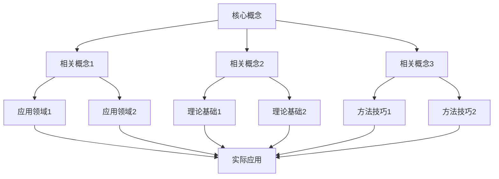
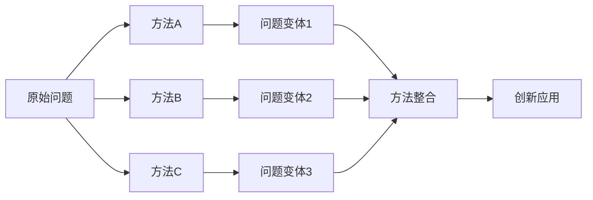
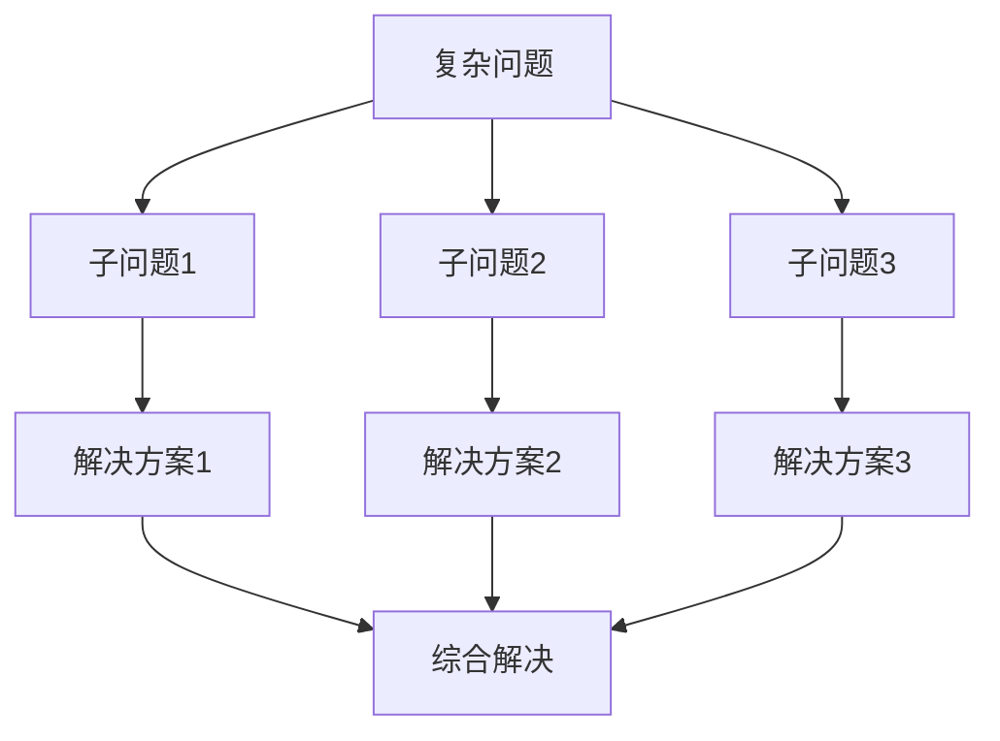
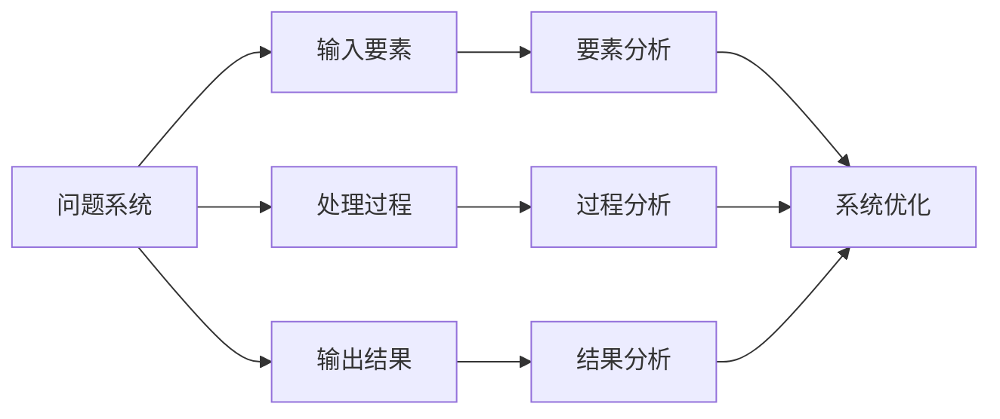
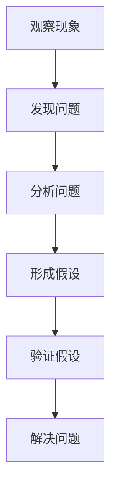
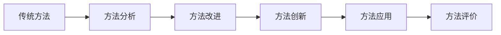
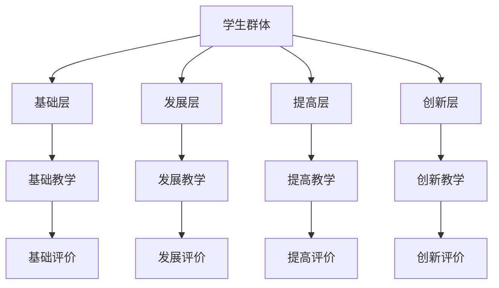
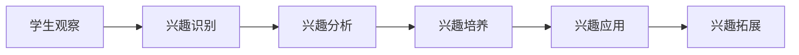
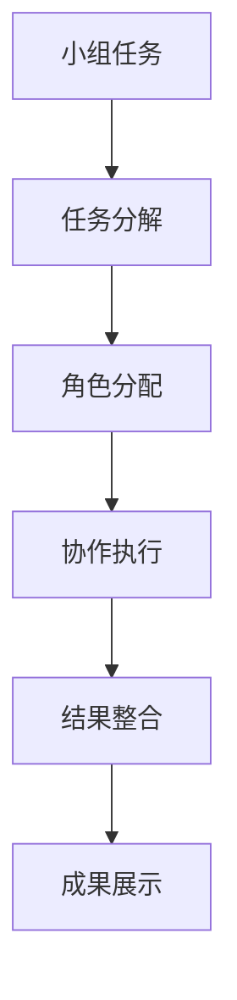
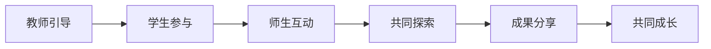

# 数学教学策略集 | Mathematical Teaching Strategy Collection

## 教学策略总览 | Teaching Strategy Overview

### 1. 知识关联性教学策略 | Knowledge Connectivity Teaching Strategies

#### 1.1 概念关联教学策略 | Concept Connectivity Teaching Strategy

**策略目标**：

- 建立数学概念之间的关联
- 形成完整的知识网络
- 提高概念理解深度
- 培养关联思维能力

**实施方法**：

**方法一：概念地图法**:



**方法二：对比分析法**:

- **相似性对比**：比较相似概念的联系
- **差异性对比**：比较不同概念的区别
- **层次性对比**：比较概念的不同层次
- **发展性对比**：比较概念的发展过程

**方法三：递进关联法**:

- **基础关联**：从基础概念开始建立关联
- **扩展关联**：逐步扩展到相关概念
- **深化关联**：深入分析概念间的深层联系
- **应用关联**：将概念关联应用到实际问题

#### 1.2 方法关联教学策略 | Method Connectivity Teaching Strategy

**策略目标**：

- 建立数学方法之间的关联
- 形成方法迁移能力
- 提高方法应用灵活性
- 培养创新思维能力

**实施方法**：

**方法一：方法迁移法**:



**方法二：问题驱动法**:

- **问题分析**：分析问题的结构和特点
- **方法选择**：选择合适的方法
- **方法应用**：应用方法解决问题
- **方法评价**：评价方法的效果

**方法三：创新应用法**:

- **方法创新**：创新数学方法
- **应用创新**：创新应用领域
- **组合创新**：组合不同方法
- **拓展创新**：拓展方法应用范围

### 2. 结构性思维教学策略 | Structural Thinking Teaching Strategies

#### 2.1 结构分析教学策略 | Structural Analysis Teaching Strategy

**策略目标**：

- 培养结构分析能力
- 提高问题理解深度
- 发展系统性思维
- 增强逻辑推理能力

**实施方法**：

**方法一：结构分解法**:



**方法二：层次分析法**:

- **表层分析**：分析问题的表面特征
- **中层分析**：分析问题的内在结构
- **深层分析**：分析问题的本质特征
- **系统分析**：进行系统性分析

**方法三：模式识别法**:

- **模式发现**：发现问题的模式
- **模式分析**：分析模式的特征
- **模式应用**：应用模式解决问题
- **模式创新**：创新模式应用

#### 2.2 系统思维教学策略 | Systematic Thinking Teaching Strategy

**策略目标**：

- 培养系统思维能力
- 提高整体把握能力
- 发展协调性思维
- 增强整合能力

**实施方法**：

**方法一：系统建模法**:



**方法二：整体分析法**:

- **整体把握**：从整体角度把握问题
- **要素分析**：分析系统各要素
- **关系分析**：分析要素间关系
- **协调优化**：协调优化系统

**方法三：动态平衡法**:

- **平衡分析**：分析系统的平衡状态
- **动态变化**：分析系统的动态变化
- **调节控制**：调节控制系统
- **稳定优化**：实现稳定优化

### 3. 创新思维教学策略 | Innovative Thinking Teaching Strategies

#### 3.1 问题创新教学策略 | Problem Innovation Teaching Strategy

**策略目标**：

- 培养问题发现能力
- 提高问题分析能力
- 发展问题解决能力
- 增强问题创新能力

**实施方法**：

**方法一：问题发现法**:



**方法二：问题变体法**:

- **条件变体**：改变问题条件
- **目标变体**：改变问题目标
- **方法变体**：改变解决方法
- **应用变体**：改变应用领域

**方法三：问题组合法**:

- **问题组合**：组合不同问题
- **方法组合**：组合不同方法
- **领域组合**：组合不同领域
- **创新组合**：创新性组合

#### 3.2 方法创新教学策略 | Method Innovation Teaching Strategy

**策略目标**：

- 培养方法创新能力
- 提高方法应用能力
- 发展方法迁移能力
- 增强方法整合能力

**实施方法**：

**方法一：方法创新法**:



**方法二：跨领域应用法**:

- **领域迁移**：将方法迁移到不同领域
- **方法整合**：整合不同领域的方法
- **创新应用**：创新性地应用方法
- **效果评价**：评价应用效果

**方法三：技术融合法**:

- **技术融合**：融合不同技术
- **方法融合**：融合不同方法
- **创新融合**：创新性融合
- **应用拓展**：拓展应用范围

### 4. 个性化教学策略 | Personalized Teaching Strategies

#### 4.1 分层教学策略 | Hierarchical Teaching Strategy

**策略目标**：

- 适应不同学习水平
- 满足不同学习需求
- 促进个性化发展
- 提高教学效果

**实施方法**：

**方法一：能力分层法**:



**方法二：内容分层法**:

- **基础内容**：适合基础层学生
- **发展内容**：适合发展层学生
- **提高内容**：适合提高层学生
- **创新内容**：适合创新层学生

**方法三：方法分层法**:

- **基础方法**：适合基础层学生
- **发展方法**：适合发展层学生
- **提高方法**：适合提高层学生
- **创新方法**：适合创新层学生

#### 4.2 兴趣导向教学策略 | Interest-oriented Teaching Strategy

**策略目标**：

- 激发学习兴趣
- 保持学习动机
- 提高学习效果
- 促进自主学习

**实施方法**：

**方法一：兴趣发现法**:



**方法二：情境创设法**:

- **生活情境**：创设生活化情境
- **问题情境**：创设问题化情境
- **探索情境**：创设探索化情境
- **创新情境**：创设创新化情境

**方法三：活动设计法**:

- **游戏活动**：设计游戏化活动
- **竞赛活动**：设计竞赛化活动
- **探究活动**：设计探究化活动
- **创新活动**：设计创新化活动

### 5. 协作教学策略 | Collaborative Teaching Strategies

#### 5.1 小组协作教学策略 | Group Collaborative Teaching Strategy

**策略目标**：

- 培养协作能力
- 提高交流能力
- 发展团队精神
- 增强集体智慧

**实施方法**：

**方法一：小组分工法**:



**方法二：角色轮换法**:

- **角色设计**：设计不同角色
- **角色分配**：分配不同角色
- **角色轮换**：定期轮换角色
- **角色评价**：评价角色表现

**方法三：成果分享法**:

- **成果展示**：展示小组成果
- **经验分享**：分享成功经验
- **问题讨论**：讨论存在问题
- **改进建议**：提出改进建议

#### 5.2 师生协作教学策略 | Teacher-Student Collaborative Teaching Strategy

**策略目标**：

- 建立良好师生关系
- 提高教学互动性
- 促进共同成长
- 增强教学效果

**实施方法**：

**方法一：互动教学法**:



**方法二：对话教学法**:

- **问题对话**：通过问题引导对话
- **观点对话**：通过观点交流对话
- **经验对话**：通过经验分享对话
- **创新对话**：通过创新思维对话

**方法三：合作探究法**:

- **问题探究**：合作探究问题
- **方法探究**：合作探究方法
- **应用探究**：合作探究应用
- **创新探究**：合作探究创新

## 教学策略实施 | Teaching Strategy Implementation

### 6. 策略选择原则 | Strategy Selection Principles

#### 1.1 目标导向原则

- **明确目标**：明确教学目标
- **目标分析**：分析目标要求
- **策略匹配**：选择匹配策略
- **效果评价**：评价策略效果

#### 1.2 学生中心原则

- **学生分析**：分析学生特点
- **需求识别**：识别学生需求
- **策略适应**：适应学生特点
- **发展促进**：促进学生发展

#### 1.3 内容适应原则

- **内容分析**：分析教学内容
- **特点把握**：把握内容特点
- **策略选择**：选择合适策略
- **效果优化**：优化教学效果

### 6.1 策略实施步骤 | Strategy Implementation Steps

#### 2.1 准备阶段

- **目标设定**：设定明确目标
- **内容准备**：准备教学内容
- **方法选择**：选择合适方法
- **资源准备**：准备教学资源

#### 2.2 实施阶段

- **策略实施**：实施教学策略
- **过程监控**：监控实施过程
- **问题处理**：处理实施问题
- **效果调整**：调整实施效果

#### 2.3 评价阶段

- **效果评价**：评价教学效果
- **问题分析**：分析存在问题
- **改进建议**：提出改进建议
- **策略优化**：优化教学策略

### 6.2 策略评价体系 | Strategy Evaluation System

#### 3.1 形成性评价

- **过程评价**：评价实施过程
- **参与评价**：评价学生参与
- **互动评价**：评价师生互动
- **效果评价**：评价即时效果

#### 3.2 总结性评价

- **目标达成**：评价目标达成
- **能力发展**：评价能力发展
- **知识掌握**：评价知识掌握
- **技能应用**：评价技能应用

#### 3.3 发展性评价

- **进步评价**：评价学习进步
- **潜力评价**：评价发展潜力
- **特长评价**：评价学习特长
- **不足评价**：评价学习不足

## 教学策略创新 | Teaching Strategy Innovation

### 7. 技术创新 | Technology Innovation

#### 1.1 信息技术应用

- **多媒体教学**：应用多媒体技术
- **网络教学**：应用网络技术
- **智能教学**：应用智能技术
- **虚拟教学**：应用虚拟技术

#### 1.2 人工智能应用

- **智能诊断**：智能诊断学习问题
- **智能推荐**：智能推荐学习内容
- **智能评价**：智能评价学习效果
- **智能辅导**：智能辅导学习过程

### 7.1 方法创新 | Method Innovation

#### 2.1 教学方法创新

- **项目教学**：创新项目教学方法
- **探究教学**：创新探究教学方法
- **合作教学**：创新合作教学方法
- **创新教学**：创新创新教学方法

#### 2.2 评价方法创新

- **多元评价**：创新多元评价方法
- **过程评价**：创新过程评价方法
- **发展评价**：创新发展评价方法
- **创新评价**：创新创新评价方法

### 7.2 内容创新 | Content Innovation

#### 3.1 教学内容创新

- **跨学科内容**：创新跨学科内容
- **前沿内容**：创新前沿内容
- **应用内容**：创新应用内容
- **创新内容**：创新创新内容

#### 3.2 资源创新

- **数字资源**：创新数字资源
- **互动资源**：创新互动资源
- **智能资源**：创新智能资源
- **创新资源**：创新创新资源

## 8. 现代前沿与跨学科创新教学策略 | Modern Frontier and Interdisciplinary Innovative Teaching Strategies

### 8.1 AI与自动化证明教学策略 | AI and Automated Proof Teaching Strategies

- 利用AI与自动化证明工具（如Lean、Coq、Isabelle）辅助学生进行定理证明、公式推导、结构化推理训练。
- Use AI and automated proof tools (Lean, Coq, Isabelle, etc.) to assist students in theorem proving, formula derivation, and structured reasoning training.
- 【策略示例 | Strategy Example】
  - 设计AI自动化证明任务，学生用Lean形式化证明柯西-施瓦茨不等式。
  - Assign AI automated proof tasks, students use Lean to formalize and prove the Cauchy-Schwarz inequality.

### 8.2 知识图谱与可视化教学策略 | Knowledge Graphs and Visual Teaching Strategies

- 构建数学知识图谱，辅助学生理解概念结构、定理关系、方法应用，结合Mermaid/LaTeX/交互式工具进行可视化教学。
- Build mathematical knowledge graphs to help students understand concept structures, theorem relations, and method applications, using Mermaid/LaTeX/interactive tools for visualization.
- 【策略示例 | Strategy Example】
  - 让学生用Mermaid绘制知识结构图，梳理代数、几何、分析等核心概念的关联。
  - Students use Mermaid to draw knowledge structure diagrams, mapping connections among algebra, geometry, analysis, etc.

### 8.3 跨学科AI建模教学策略 | Interdisciplinary AI Modeling Teaching Strategies

- 利用AI算法与跨学科建模方法，指导学生分析现实系统（如交通、生态、经济），培养建模与优化能力。
- Use AI algorithms and interdisciplinary modeling methods to guide students in analyzing real-world systems (traffic, ecology, economy), cultivating modeling and optimization skills.

### 8.4 脑科学与认知教学策略 | Neuroscience and Cognitive Teaching Strategies

- 结合脑科学与认知科学理论，优化数学学习路径、认知负荷管理、创新思维训练。
- Combine neuroscience and cognitive science theories to optimize math learning paths, cognitive load management, and creative thinking training.

### 8.5 哲学与自动化证明教学策略 | Philosophy and Automated Proof Teaching Strategies

- 分析不同哲学流派（形式主义、结构主义、直觉主义等）对数学教学与自动化证明的影响，设计多元真理观下的教学策略。
- Analyze the impact of different philosophical schools (formalism, structuralism, intuitionism, etc.) on math teaching and automated proof, designing teaching strategies under pluralistic views of truth.

### 8.6 可视化表达与创新教学策略 | Visualization and Innovative Teaching Strategies

- 针对高维结构、分形、网络等复杂对象，设计可视化教学与交互式探索策略，结合AI/知识图谱/可视化工具提升认知与创新能力。
- For complex objects such as high-dimensional structures, fractals, networks, design visual and interactive teaching strategies, combining AI/knowledge graphs/visualization tools to enhance cognition and innovation.

> 本节策略持续递归扩展，结合AI、知识图谱、自动化证明、脑科学、可视化等前沿，突出数学教学的创新性、国际化与多学科融合。
> This section of strategies will be recursively expanded, integrating AI, knowledge graphs, automated proof, neuroscience, visualization, etc., highlighting the innovation, internationalization, and interdisciplinary integration of mathematics teaching.

## 教学策略发展展望 | Teaching Strategy Development Prospects

### 9.1 技术发展趋势 | Technology Development Trends

#### 1.1 人工智能发展

- **智能教学**：AI辅助个性化教学
- **智能评价**：AI辅助教学评价
- **智能推荐**：AI辅助内容推荐
- **智能创新**：AI辅助教学创新

#### 1.2 虚拟现实发展

- **虚拟教学**：VR辅助数学教学
- **虚拟实验**：VR辅助数学实验
- **虚拟探索**：VR辅助数学探索
- **虚拟创新**：VR辅助数学创新

### 9.2 教育发展趋势 | Education Development Trends

#### 2.1 个性化发展

- **个性化教学**：根据个人特点设计教学
- **个性化评价**：根据个人特点设计评价
- **个性化发展**：根据个人特点促进发展
- **个性化创新**：根据个人特点促进创新

#### 2.2 协作化发展

- **协作教学**：通过协作进行教学
- **协作评价**：通过协作进行评价
- **协作发展**：通过协作促进发展
- **协作创新**：通过协作促进创新

### 9.3 研究发展趋势 | Research Development Trends

#### 3.1 认知科学研究

- **认知过程**：研究教学认知过程
- **认知机制**：研究教学认知机制
- **认知发展**：研究教学认知发展
- **认知应用**：研究教学认知应用

#### 3.2 教育学研究

- **教学理论**：发展教学理论
- **学习理论**：发展学习理论
- **评价理论**：发展评价理论
- **发展理论**：发展发展理论

## 新一轮AI驱动与国际化教学创新策略 | New Round of AI-Driven and International Teaching Innovation Strategies

### 3. AI驱动的教学创新策略 | AI-Driven Teaching Innovation Strategies

#### 3.1 智能教学助手应用 | Intelligent Teaching Assistant Applications

**基于学习数据的AI个性化教学方案设计**：

1. **学习数据分析**：
   - 收集学生的答题数据、学习时间、错误模式
   - 分析学生的知识掌握程度和学习偏好
   - 识别学生的薄弱环节和优势领域

2. **智能推荐系统**：
   - 基于学习数据推荐适合的习题难度
   - 根据学习进度调整学习路径
   - 结合认知负荷理论优化学习节奏

3. **动态调整机制**：
   - 实时监控学习效果和认知负荷
   - 根据学习表现动态调整学习内容
   - 提供个性化的学习建议和指导

**Python智能教学助手代码示例**：

```python
import numpy as np
import pandas as pd
from sklearn.cluster import KMeans
from sklearn.metrics import silhouette_score
import matplotlib.pyplot as plt

def ai_teaching_assistant():
    """
    AI驱动的智能教学助手
    """
    # 模拟学生学习数据
    np.random.seed(42)
    n_students = 100
    
    # 生成学生特征数据
    student_data = {
        'visual_score': np.random.normal(0.6, 0.2, n_students),
        'analytical_score': np.random.normal(0.5, 0.2, n_students),
        'practice_time': np.random.normal(2.0, 0.5, n_students),
        'error_rate': np.random.normal(0.3, 0.1, n_students),
        'improvement_rate': np.random.normal(0.4, 0.15, n_students)
    }
    
    # 创建DataFrame
    df = pd.DataFrame(student_data)
    
    # 学习模式聚类
    features = df[['visual_score', 'analytical_score', 'practice_time', 
                   'error_rate', 'improvement_rate']].values
    
    kmeans = KMeans(n_clusters=3, random_state=42)
    learning_patterns = kmeans.fit_predict(features)
    
    # 生成个性化教学策略
    def generate_personalized_strategy(student_profile):
        """生成个性化教学策略"""
        if student_profile['visual_score'] > 0.6:
            strategy = "重点使用可视化教学"
        elif student_profile['analytical_score'] > 0.6:
            strategy = "重点使用分析性教学"
        else:
            strategy = "使用综合教学方法"
        
        # 根据错误率调整难度
        if student_profile['error_rate'] > 0.4:
            difficulty = "降低难度，加强基础"
        elif student_profile['error_rate'] < 0.2:
            difficulty = "提高难度，拓展应用"
        else:
            difficulty = "保持当前难度"
        
        # 根据改进率调整节奏
        if student_profile['improvement_rate'] > 0.5:
            pace = "加快学习节奏"
        elif student_profile['improvement_rate'] < 0.3:
            pace = "放慢学习节奏"
        else:
            pace = "保持当前节奏"
        
        return {
            'strategy': strategy,
            'difficulty': difficulty,
            'pace': pace,
            'recommended_tools': ['GeoGebra', 'Desmos', 'Python'] if student_profile['visual_score'] > 0.6 else ['Wolfram Alpha', 'Mathematica']
        }
    
    # 可视化分析结果
    fig, ((ax1, ax2), (ax3, ax4)) = plt.subplots(2, 2, figsize=(15, 12))
    
    # 子图1：学习模式分布
    pattern_counts = np.bincount(learning_patterns)
    pattern_labels = ['视觉型', '分析型', '综合型']
    
    ax1.pie(pattern_counts, labels=pattern_labels, autopct='%1.1f%%', startangle=90)
    ax1.set_title('学生学习模式分布')
    
    # 子图2：特征相关性
    correlation_matrix = df.corr()
    im = ax2.imshow(correlation_matrix, cmap='coolwarm', aspect='auto')
    ax2.set_xticks(range(len(correlation_matrix.columns)))
    ax2.set_yticks(range(len(correlation_matrix.columns)))
    ax2.set_xticklabels(correlation_matrix.columns, rotation=45)
    ax2.set_yticklabels(correlation_matrix.columns)
    ax2.set_title('学习特征相关性')
    plt.colorbar(im, ax=ax2)
    
    # 子图3：改进率vs错误率
    scatter = ax3.scatter(df['error_rate'], df['improvement_rate'], 
                          c=learning_patterns, cmap='viridis', alpha=0.6)
    ax3.set_xlabel('错误率')
    ax3.set_ylabel('改进率')
    ax3.set_title('学习效果分析')
    plt.colorbar(scatter, ax=ax3)
    
    # 子图4：学习时间分布
    ax4.hist(df['practice_time'], bins=20, alpha=0.7, color='orange')
    ax4.axvline(x=df['practice_time'].mean(), color='red', 
                linestyle='--', linewidth=2, label='平均值')
    ax4.set_xlabel('学习时间（小时/天）')
    ax4.set_ylabel('学生数量')
    ax4.set_title('学习时间分布')
    ax4.legend()
    ax4.grid(True, alpha=0.3)
    
    plt.tight_layout()
    plt.show()
    
    # 生成个性化建议
    print("AI教学助手分析结果:")
    print(f"学生总数: {n_students}")
    print(f"学习模式数: {len(np.unique(learning_patterns))}")
    print(f"平均学习时间: {df['practice_time'].mean():.2f} 小时/天")
    print(f"平均错误率: {df['error_rate'].mean():.2f}")
    print(f"平均改进率: {df['improvement_rate'].mean():.2f}")
    
    # 为典型学生生成个性化策略
    typical_student = df.iloc[0].to_dict()
    strategy = generate_personalized_strategy(typical_student)
    
    print(f"\n典型学生个性化教学策略:")
    print(f"教学策略: {strategy['strategy']}")
    print(f"难度调整: {strategy['difficulty']}")
    print(f"学习节奏: {strategy['pace']}")
    print(f"推荐工具: {', '.join(strategy['recommended_tools'])}")
    
    return df, learning_patterns, strategy
```

#### 3.2 AI自动化教学工具 | AI Automated Teaching Tools

**推荐AI工具的实际应用**：

1. **ChatGPT辅助数学概念解释**：
   - 提供个性化的概念解释
   - 生成多种解题思路
   - 回答学生的疑问

2. **Lean、Coq等工具进行自动化证明验证**：
   - 验证数学证明的正确性
   - 辅助生成形式化证明
   - 检查证明的完整性

3. **Wolfram Alpha、GeoGebra AI等工具进行数学计算和可视化**：
   - 进行复杂的数学计算
   - 生成动态几何图形
   - 提供交互式数学体验

**Python AI教学工具集成代码示例**：

```python
import numpy as np
import matplotlib.pyplot as plt
from sklearn.linear_model import LinearRegression
from sklearn.metrics import mean_squared_error, r2_score

def ai_teaching_tools_integration():
    """
    AI教学工具集成应用
    """
    # 模拟数学概念学习数据
    np.random.seed(42)
    n_concepts = 10
    n_students = 50
    
    # 概念难度和学习效果数据
    concept_difficulty = np.random.uniform(0.3, 0.8, n_concepts)
    ai_assistance_level = np.random.uniform(0.2, 0.9, n_concepts)
    
    # 学生学习效果（考虑AI辅助）
    student_performance = []
    for i in range(n_students):
        performance = []
        for j in range(n_concepts):
            # 基础学习效果
            base_performance = 0.5 + 0.3 * np.random.normal()
            # AI辅助提升
            ai_boost = ai_assistance_level[j] * 0.3
            # 难度影响
            difficulty_effect = (1 - concept_difficulty[j]) * 0.2
            
            final_performance = base_performance + ai_boost + difficulty_effect
            performance.append(max(0, min(1, final_performance)))
        
        student_performance.append(performance)
    
    student_performance = np.array(student_performance)
    
    # 可视化分析
    fig, ((ax1, ax2), (ax3, ax4)) = plt.subplots(2, 2, figsize=(15, 12))
    
    # 子图1：AI辅助效果分析
    ai_effect = np.mean(student_performance, axis=0)
    
    ax1.scatter(ai_assistance_level, ai_effect, alpha=0.7, s=100)
    ax1.set_xlabel('AI辅助水平')
    ax1.set_ylabel('学习效果')
    ax1.set_title('AI辅助效果分析')
    ax1.grid(True, alpha=0.3)
    
    # 添加趋势线
    z = np.polyfit(ai_assistance_level, ai_effect, 1)
    p = np.poly1d(z)
    ax1.plot(ai_assistance_level, p(ai_assistance_level), "r--", alpha=0.8)
    
    # 子图2：概念难度vs学习效果
    difficulty_effect = np.mean(student_performance, axis=0)
    
    ax2.scatter(concept_difficulty, difficulty_effect, alpha=0.7, s=100, color='green')
    ax2.set_xlabel('概念难度')
    ax2.set_ylabel('学习效果')
    ax2.set_title('概念难度对学习效果的影响')
    ax2.grid(True, alpha=0.3)
    
    # 子图3：学生个体差异
    individual_avg = np.mean(student_performance, axis=1)
    
    ax3.hist(individual_avg, bins=15, alpha=0.7, color='orange')
    ax3.axvline(x=np.mean(individual_avg), color='red', 
                linestyle='--', linewidth=2, label='平均值')
    ax3.set_xlabel('个人平均学习效果')
    ax3.set_ylabel('学生数量')
    ax3.set_title('学生个体差异分布')
    ax3.legend()
    ax3.grid(True, alpha=0.3)
    
    # 子图4：AI工具推荐
    tools = ['ChatGPT', 'Wolfram Alpha', 'GeoGebra', 'Desmos', 'Python']
    tool_effectiveness = [0.8, 0.9, 0.7, 0.6, 0.85]
    tool_usage = [0.9, 0.6, 0.8, 0.7, 0.5]
    
    x = np.arange(len(tools))
    width = 0.35
    
    ax4.bar(x - width/2, tool_effectiveness, width, label='效果评分', alpha=0.7)
    ax4.bar(x + width/2, tool_usage, width, label='使用频率', alpha=0.7)
    
    ax4.set_xlabel('AI教学工具')
    ax4.set_ylabel('评分')
    ax4.set_title('AI教学工具效果对比')
    ax4.set_xticks(x)
    ax4.set_xticklabels(tools, rotation=45)
    ax4.legend()
    ax4.grid(True, alpha=0.3)
    
    plt.tight_layout()
    plt.show()
    
    # 分析结果
    print("AI教学工具集成分析结果:")
    print(f"概念数量: {n_concepts}")
    print(f"学生数量: {n_students}")
    print(f"平均AI辅助水平: {np.mean(ai_assistance_level):.3f}")
    print(f"平均学习效果: {np.mean(student_performance):.3f}")
    print(f"AI辅助与学习效果相关系数: {np.corrcoef(ai_assistance_level, ai_effect)[0,1]:.3f}")
    
    # 推荐最佳AI工具组合
    tool_scores = np.array(tool_effectiveness) * np.array(tool_usage)
    best_tools = [tools[i] for i in np.argsort(tool_scores)[-3:]]
    
    print(f"\n推荐AI工具组合: {', '.join(best_tools)}")
    
    return student_performance, ai_assistance_level, best_tools
```

#### 3.3 智能教学评价 | Intelligent Teaching Evaluation

**AI辅助教学诊断和评价**：

1. **学习效果评估**：
   - 实时分析学生答题数据
   - 识别学习薄弱环节
   - 提供针对性改进建议

2. **教学策略优化**：
   - 基于学习数据调整教学策略
   - 优化教学内容和节奏
   - 个性化教学方案设计

3. **协作学习评价**：
   - 评估小组学习效果
   - 分析协作模式
   - 优化团队学习策略

**Python智能教学评价代码示例**：

```python
import numpy as np
import matplotlib.pyplot as plt
from sklearn.cluster import KMeans
from sklearn.metrics import silhouette_score

def intelligent_teaching_evaluation():
    """
    智能教学评价系统
    """
    # 模拟教学评价数据
    np.random.seed(42)
    n_students = 100
    n_metrics = 6
    
    # 评价指标
    metrics = ['知识掌握', '解题能力', '创新思维', '协作能力', '学习态度', '进步速度']
    
    # 生成学生评价数据
    student_scores = np.random.normal(0.6, 0.2, (n_students, n_metrics))
    student_scores = np.clip(student_scores, 0, 1)  # 限制在0-1之间
    
    # 添加一些模式
    # 高知识掌握的学生通常解题能力也强
    student_scores[:, 1] += 0.3 * student_scores[:, 0]
    # 创新思维与协作能力相关
    student_scores[:, 3] += 0.2 * student_scores[:, 2]
    
    # 重新标准化到0-1
    student_scores = np.clip(student_scores, 0, 1)
    
    # 聚类分析学生类型
    kmeans = KMeans(n_clusters=4, random_state=42)
    student_types = kmeans.fit_predict(student_scores)
    
    # 可视化分析
    fig, ((ax1, ax2), (ax3, ax4)) = plt.subplots(2, 2, figsize=(15, 12))
    
    # 子图1：各指标平均表现
    avg_scores = np.mean(student_scores, axis=0)
    
    bars = ax1.bar(metrics, avg_scores, color='skyblue', alpha=0.7)
    ax1.set_ylabel('平均得分')
    ax1.set_title('各评价指标平均表现')
    ax1.set_xticklabels(metrics, rotation=45)
    ax1.grid(True, alpha=0.3)
    
    # 添加数值标签
    for bar, score in zip(bars, avg_scores):
        height = bar.get_height()
        ax1.text(bar.get_x() + bar.get_width()/2., height + 0.01,
                f'{score:.2f}', ha='center', va='bottom')
    
    # 子图2：学生类型分布
    type_counts = np.bincount(student_types)
    type_labels = ['全面发展型', '知识型', '创新型', '协作型']
    
    colors = ['lightblue', 'lightgreen', 'lightyellow', 'lightcoral']
    ax2.pie(type_counts, labels=type_labels, autopct='%1.1f%%', 
            colors=colors, startangle=90)
    ax2.set_title('学生类型分布')
    
    # 子图3：各类型学生特征雷达图
    type_means = []
    for i in range(4):
        type_mask = student_types == i
        type_mean = np.mean(student_scores[type_mask], axis=0)
        type_means.append(type_mean)
    
    # 雷达图
    angles = np.linspace(0, 2*np.pi, n_metrics, endpoint=False).tolist()
    angles += angles[:1]  # 闭合图形
    
    ax3 = plt.subplot(2, 2, 3, projection='polar')
    for i, (type_mean, color) in enumerate(zip(type_means, colors)):
        values = type_mean.tolist()
        values += values[:1]  # 闭合图形
        ax3.plot(angles, values, 'o-', linewidth=2, label=type_labels[i], color=color)
        ax3.fill(angles, values, alpha=0.25, color=color)
    
    ax3.set_xticks(angles[:-1])
    ax3.set_xticklabels(metrics)
    ax3.set_ylim(0, 1)
    ax3.set_title('各类型学生特征雷达图')
    ax3.legend(loc='upper right', bbox_to_anchor=(1.3, 1.0))
    
    # 子图4：进步趋势分析
    # 模拟时间序列数据
    time_points = 5
    progress_data = np.random.normal(0.1, 0.05, (n_students, time_points))
    progress_data = np.cumsum(progress_data, axis=1)
    progress_data += np.random.normal(0.5, 0.1, (n_students, 1))
    
    time_series = np.arange(time_points)
    avg_progress = np.mean(progress_data, axis=0)
    std_progress = np.std(progress_data, axis=0)
    
    ax4.plot(time_series, avg_progress, 'b-', linewidth=2, label='平均进步')
    ax4.fill_between(time_series, avg_progress - std_progress, 
                     avg_progress + std_progress, alpha=0.3, color='blue')
    ax4.set_xlabel('时间点')
    ax4.set_ylabel('学习水平')
    ax4.set_title('学习进步趋势分析')
    ax4.legend()
    ax4.grid(True, alpha=0.3)
    
    plt.tight_layout()
    plt.show()
    
    # 分析结果
    print("智能教学评价分析结果:")
    print(f"学生总数: {n_students}")
    print(f"评价指标数: {n_metrics}")
    print(f"学生类型数: {len(np.unique(student_types))}")
    
    # 各类型学生特点
    for i, type_label in enumerate(type_labels):
        type_mask = student_types == i
        type_count = np.sum(type_mask)
        type_percentage = type_count / n_students * 100
        best_metric = metrics[np.argmax(type_means[i])]
        print(f"{type_label}: {type_count}人 ({type_percentage:.1f}%), 优势: {best_metric}")
    
    # 教学建议
    print(f"\n教学建议:")
    print(f"1. 全面发展型学生: 提供综合性挑战任务")
    print(f"2. 知识型学生: 加强创新思维和协作能力培养")
    print(f"3. 创新型学生: 提供更多创新实践机会")
    print(f"4. 协作型学生: 加强个人知识掌握和解题能力")
    
    return student_scores, student_types, type_means
```

### 4. 国际化教学创新策略 | International Teaching Innovation Strategies

#### 4.1 多语种教学策略 | Multilingual Teaching Strategies

**多语种数学教材和教学资源设计**：

1. **多语种数学表达对照**：
   - 中英德法四语种数学术语对照
   - 统一国际数学表达标准
   - 提供多语种数学翻译

2. **跨文化数学交流活动**：
   - 组织国际数学交流活动
   - 培养跨文化数学交流能力
   - 建立全球数学学习社区

**Python多语种教学分析代码示例**：

```python
import numpy as np
import matplotlib.pyplot as plt
import pandas as pd

def multilingual_teaching_analysis():
    """
    多语种教学策略分析
    """
    # 多语种数学术语数据
    languages = ['中文', 'English', 'Deutsch', 'Français']
    math_terms = [
        '集合', '函数', '极限', '导数', '积分', '概率', '统计',
        '线性代数', '几何', '三角学', '微积分', '离散数学'
    ]
    
    # 多语种对照表
    multilingual_terms = {
        '中文': ['集合', '函数', '极限', '导数', '积分', '概率', '统计', '线性代数', '几何', '三角学', '微积分', '离散数学'],
        'English': ['Set', 'Function', 'Limit', 'Derivative', 'Integral', 'Probability', 'Statistics', 'Linear Algebra', 'Geometry', 'Trigonometry', 'Calculus', 'Discrete Mathematics'],
        'Deutsch': ['Menge', 'Funktion', 'Grenzwert', 'Ableitung', 'Integral', 'Wahrscheinlichkeit', 'Statistik', 'Lineare Algebra', 'Geometrie', 'Trigonometrie', 'Infinitesimalrechnung', 'Diskrete Mathematik'],
        'Français': ['Ensemble', 'Fonction', 'Limite', 'Dérivée', 'Intégrale', 'Probabilité', 'Statistique', 'Algèbre linéaire', 'Géométrie', 'Trigonométrie', 'Calcul infinitésimal', 'Mathématiques discrètes']
    }
    
    # 语言学习难度评估
    difficulty_scores = {
        '中文': [0.3, 0.4, 0.6, 0.7, 0.6, 0.5, 0.4, 0.8, 0.5, 0.6, 0.8, 0.7],
        'English': [0.2, 0.3, 0.5, 0.6, 0.5, 0.4, 0.3, 0.7, 0.4, 0.5, 0.7, 0.6],
        'Deutsch': [0.4, 0.5, 0.7, 0.8, 0.7, 0.6, 0.5, 0.9, 0.6, 0.7, 0.9, 0.8],
        'Français': [0.5, 0.6, 0.8, 0.9, 0.8, 0.7, 0.6, 1.0, 0.7, 0.8, 1.0, 0.9]
    }
    
    # 可视化分析
    fig, ((ax1, ax2), (ax3, ax4)) = plt.subplots(2, 2, figsize=(15, 12))
    
    # 子图1：多语种术语长度对比
    term_lengths = {}
    for lang in languages:
        lengths = [len(term) for term in multilingual_terms[lang]]
        term_lengths[lang] = lengths
    
    x = np.arange(len(math_terms))
    width = 0.2
    
    for i, lang in enumerate(languages):
        ax1.bar(x + i*width, term_lengths[lang], width, label=lang, alpha=0.7)
    
    ax1.set_xlabel('数学术语')
    ax1.set_ylabel('字符长度')
    ax1.set_title('多语种数学术语长度对比')
    ax1.set_xticks(x + width*1.5)
    ax1.set_xticklabels(range(1, len(math_terms)+1))
    ax1.legend()
    ax1.grid(True, alpha=0.3)
    
    # 子图2：语言学习难度分析
    avg_difficulty = {}
    for lang in languages:
        avg_difficulty[lang] = np.mean(difficulty_scores[lang])
    
    bars = ax2.bar(languages, list(avg_difficulty.values()), 
                   color=['red', 'blue', 'green', 'orange'], alpha=0.7)
    ax2.set_ylabel('平均学习难度')
    ax2.set_title('各语言数学学习难度')
    ax2.grid(True, alpha=0.3)
    
    # 添加数值标签
    for bar, value in zip(bars, avg_difficulty.values()):
        height = bar.get_height()
        ax2.text(bar.get_x() + bar.get_width()/2., height + 0.01,
                f'{value:.2f}', ha='center', va='bottom')
    
    # 子图3：术语复杂度热力图
    complexity_matrix = np.array([difficulty_scores[lang] for lang in languages])
    
    im = ax3.imshow(complexity_matrix, cmap='viridis', aspect='auto')
    ax3.set_xticks(range(len(math_terms)))
    ax3.set_yticks(range(len(languages)))
    ax3.set_xticklabels(range(1, len(math_terms)+1))
    ax3.set_yticklabels(languages)
    ax3.set_title('多语种数学术语复杂度热力图')
    plt.colorbar(im, ax=ax3)
    
    # 子图4：国际交流效果分析
    # 模拟国际交流数据
    countries = ['中国', '美国', '德国', '法国', '日本', '俄罗斯']
    communication_effectiveness = [0.8, 0.7, 0.6, 0.6, 0.5, 0.7]
    cultural_understanding = [0.9, 0.8, 0.7, 0.7, 0.6, 0.8]
    
    x = np.arange(len(countries))
    width = 0.35
    
    ax4.bar(x - width/2, communication_effectiveness, width, 
            label='交流效果', alpha=0.7)
    ax4.bar(x + width/2, cultural_understanding, width, 
            label='文化理解', alpha=0.7)
    
    ax4.set_xlabel('国家')
    ax4.set_ylabel('评分')
    ax4.set_title('国际数学交流效果分析')
    ax4.set_xticks(x)
    ax4.set_xticklabels(countries)
    ax4.legend()
    ax4.grid(True, alpha=0.3)
    
    plt.tight_layout()
    plt.show()
    
    # 分析结果
    print("多语种教学策略分析结果:")
    print(f"支持语言数: {len(languages)}")
    print(f"数学术语数: {len(math_terms)}")
    
    # 语言难度排名
    difficulty_ranking = sorted(avg_difficulty.items(), key=lambda x: x[1])
    print(f"\n语言学习难度排名:")
    for i, (lang, difficulty) in enumerate(difficulty_ranking):
        print(f"{i+1}. {lang}: {difficulty:.2f}")
    
    # 教学建议
    print(f"\n多语种教学建议:")
    print(f"1. 优先使用{min(avg_difficulty, key=avg_difficulty.get)}进行基础教学")
    print(f"2. 逐步引入其他语言，提高国际化水平")
    print(f"3. 设计跨文化数学交流活动")
    print(f"4. 建立多语种数学学习资源库")
    
    return multilingual_terms, difficulty_scores, avg_difficulty
```

#### 4.2 跨文化数学教学策略 | Cross-cultural Mathematical Teaching Strategies

**跨文化数学教学创新**：

1. **不同文化的数学发展历史**：
   - 中国古代数学成就
   - 古希腊数学传统
   - 阿拉伯数学贡献
   - 现代数学发展

2. **跨文化数学思维特点**：
   - 东方数学思维：直觉性、整体性
   - 西方数学思维：逻辑性、分析性
   - 综合数学思维：融合创新

**Python跨文化教学分析代码示例**：

```python
import numpy as np
import matplotlib.pyplot as plt

def cross_cultural_teaching_analysis():
    """
    跨文化数学教学分析
    """
    # 不同文化数学思维特点数据
    cultures = ['东方思维', '西方思维', '综合思维']
    characteristics = {
        '直觉性': [0.8, 0.4, 0.6],
        '逻辑性': [0.6, 0.8, 0.7],
        '创造性': [0.7, 0.6, 0.8],
        '系统性': [0.5, 0.7, 0.6],
        '抽象性': [0.6, 0.8, 0.7],
        '应用性': [0.7, 0.5, 0.6]
    }
    
    # 历史数学成就对比
    historical_achievements = {
        '中国古代': ['九章算术', '算经十书', '天元术', '四元术'],
        '古希腊': ['欧几里得几何', '毕达哥拉斯定理', '阿基米德原理', '圆锥曲线'],
        '阿拉伯': ['代数', '三角学', '十进制', '算法'],
        '现代': ['微积分', '集合论', '拓扑学', '代数几何']
    }
    
    # 可视化分析
    fig, ((ax1, ax2), (ax3, ax4)) = plt.subplots(2, 2, figsize=(15, 12))
    
    # 子图1：文化思维特点雷达图
    angles = np.linspace(0, 2*np.pi, len(characteristics), endpoint=False).tolist()
    angles += angles[:1]  # 闭合图形
    
    ax1 = plt.subplot(2, 2, 1, projection='polar')
    colors = ['red', 'blue', 'green']
    
    for i, culture in enumerate(cultures):
        values = [characteristics[char][i] for char in characteristics.keys()]
        values += values[:1]  # 闭合图形
        ax1.plot(angles, values, 'o-', linewidth=2, label=culture, color=colors[i])
        ax1.fill(angles, values, alpha=0.25, color=colors[i])
    
    ax1.set_xticks(angles[:-1])
    ax1.set_xticklabels(characteristics.keys())
    ax1.set_ylim(0, 1)
    ax1.set_title('跨文化数学思维特点')
    ax1.legend(loc='upper right', bbox_to_anchor=(1.3, 1.0))
    
    # 子图2：历史成就对比
    achievement_counts = [len(achievements) for achievements in historical_achievements.values()]
    periods = list(historical_achievements.keys())
    
    bars = ax2.bar(periods, achievement_counts, 
                   color=['orange', 'blue', 'green', 'red'], alpha=0.7)
    ax2.set_ylabel('重要成就数量')
    ax2.set_title('不同时期数学成就对比')
    ax2.grid(True, alpha=0.3)
    
    # 添加数值标签
    for bar, count in zip(bars, achievement_counts):
        height = bar.get_height()
        ax2.text(bar.get_x() + bar.get_width()/2., height + 0.1,
                str(count), ha='center', va='bottom')
    
    # 子图3：教学方法对比
    teaching_methods = ['直观教学', '逻辑教学', '综合教学', '应用教学', '创新教学']
    method_effectiveness = {
        '东方思维': [0.9, 0.6, 0.7, 0.8, 0.7],
        '西方思维': [0.6, 0.9, 0.8, 0.7, 0.8],
        '综合思维': [0.8, 0.8, 0.9, 0.8, 0.9]
    }
    
    x = np.arange(len(teaching_methods))
    width = 0.25
    
    for i, culture in enumerate(cultures):
        values = method_effectiveness[culture]
        ax3.bar(x + i*width, values, width, label=culture, alpha=0.7)
    
    ax3.set_xlabel('教学方法')
    ax3.set_ylabel('效果评分')
    ax3.set_title('不同文化背景下的教学方法效果')
    ax3.set_xticks(x + width)
    ax3.set_xticklabels(teaching_methods, rotation=45)
    ax3.legend()
    ax3.grid(True, alpha=0.3)
    
    # 子图4：学习效果对比
    learning_outcomes = {
        '概念理解': [0.8, 0.7, 0.85],
        '解题能力': [0.7, 0.8, 0.85],
        '创新思维': [0.75, 0.7, 0.9],
        '应用能力': [0.8, 0.75, 0.85],
        '协作能力': [0.85, 0.7, 0.9]
    }
    
    outcomes = list(learning_outcomes.keys())
    x = np.arange(len(outcomes))
    width = 0.25
    
    for i, culture in enumerate(cultures):
        values = [learning_outcomes[outcome][i] for outcome in outcomes]
        ax4.bar(x + i*width, values, width, label=culture, alpha=0.7)
    
    ax4.set_xlabel('学习效果指标')
    ax4.set_ylabel('评分')
    ax4.set_title('不同文化背景下的学习效果')
    ax4.set_xticks(x + width)
    ax4.set_xticklabels(outcomes, rotation=45)
    ax4.legend()
    ax4.grid(True, alpha=0.3)
    
    plt.tight_layout()
    plt.show()
    
    # 分析结果
    print("跨文化数学教学分析结果:")
    print(f"文化类型数: {len(cultures)}")
    print(f"历史时期数: {len(historical_achievements)}")
    print(f"教学方法数: {len(teaching_methods)}")
    
    # 最佳教学策略
    best_methods = {}
    for culture in cultures:
        best_method = teaching_methods[np.argmax(method_effectiveness[culture])]
        best_methods[culture] = best_method
    
    print(f"\n各文化最佳教学方法:")
    for culture, method in best_methods.items():
        print(f"{culture}: {method}")
    
    # 教学建议
    print(f"\n跨文化教学建议:")
    print(f"1. 融合东西方数学思维优势")
    print(f"2. 设计跨文化数学交流活动")
    print(f"3. 引入历史数学成就案例")
    print(f"4. 培养国际化数学视野")
    
    return characteristics, historical_achievements, best_methods
```

---

> 本轮为SeniorMath项目教学策略AI驱动与国际化递归完善的最新进展，持续融合前沿技术与创新理念，为高中数学教育提供全面的教学创新资源。所有内容均采用中英双语标准，支持AI驱动、可视化、国际化、跨学科融合等创新方向。
