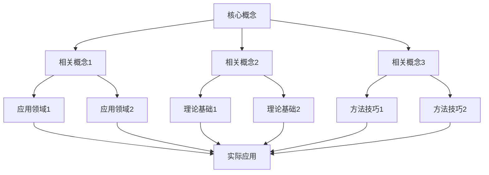
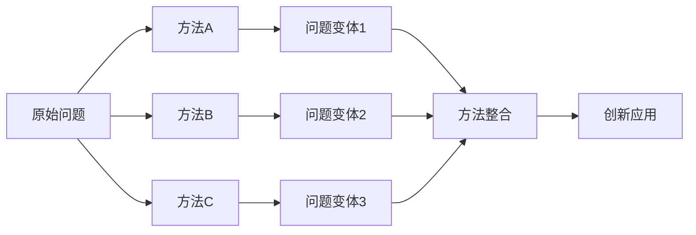
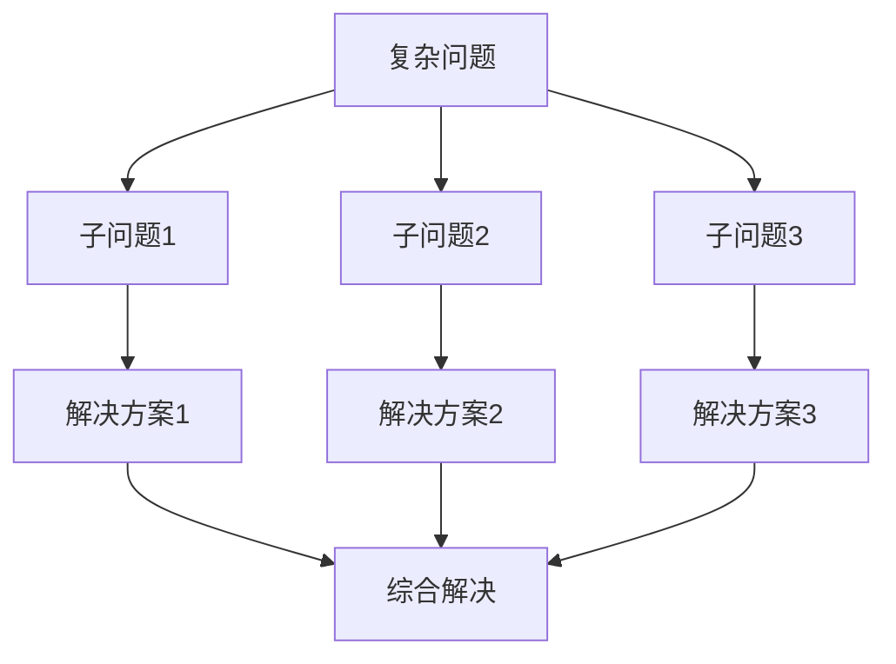
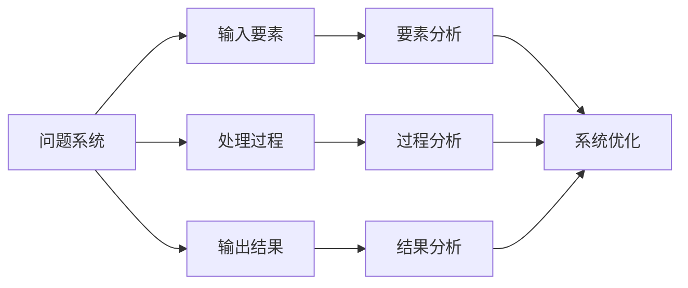
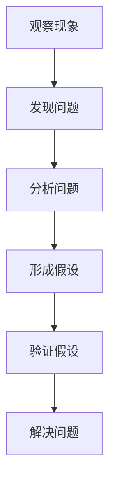
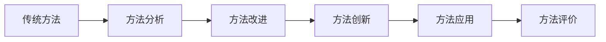
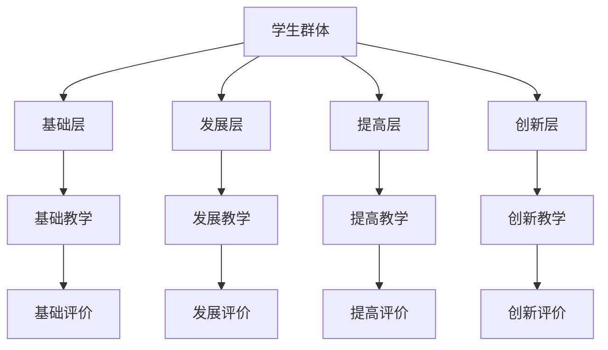
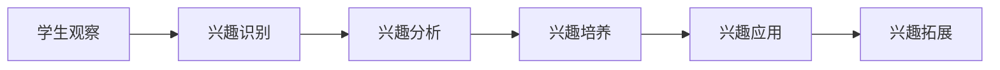
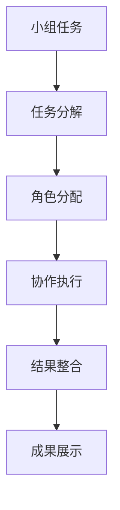
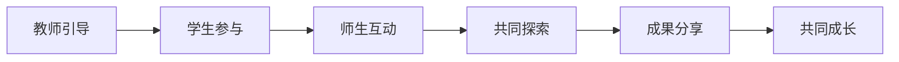

# 数学教学策略集 | Mathematical Teaching Strategy Collection

## 教学策略总览 | Teaching Strategy Overview

### 1. 知识关联性教学策略 | Knowledge Connectivity Teaching Strategies

#### 1.1 概念关联教学策略 | Concept Connectivity Teaching Strategy

**策略目标**：

- 建立数学概念之间的关联
- 形成完整的知识网络
- 提高概念理解深度
- 培养关联思维能力

**实施方法**：

**方法一：概念地图法**:

**方法二：对比分析法**:

- **相似性对比**：比较相似概念的联系
- **差异性对比**：比较不同概念的区别
- **层次性对比**：比较概念的不同层次
- **发展性对比**：比较概念的发展过程

**方法三：递进关联法**:

- **基础关联**：从基础概念开始建立关联
- **扩展关联**：逐步扩展到相关概念
- **深化关联**：深入分析概念间的深层联系
- **应用关联**：将概念关联应用到实际问题

#### 1.2 方法关联教学策略 | Method Connectivity Teaching Strategy

**策略目标**：

- 建立数学方法之间的关联
- 形成方法迁移能力
- 提高方法应用灵活性
- 培养创新思维能力

**实施方法**：

**方法一：方法迁移法**:

**方法二：问题驱动法**:

- **问题分析**：分析问题的结构和特点
- **方法选择**：选择合适的方法
- **方法应用**：应用方法解决问题
- **方法评价**：评价方法的效果

**方法三：创新应用法**:

- **方法创新**：创新数学方法
- **应用创新**：创新应用领域
- **组合创新**：组合不同方法
- **拓展创新**：拓展方法应用范围

### 2. 结构性思维教学策略 | Structural Thinking Teaching Strategies

#### 2.1 结构分析教学策略 | Structural Analysis Teaching Strategy

**策略目标**：

- 培养结构分析能力
- 提高问题理解深度
- 发展系统性思维
- 增强逻辑推理能力

**实施方法**：

**方法一：结构分解法**:

**方法二：层次分析法**:

- **表层分析**：分析问题的表面特征
- **中层分析**：分析问题的内在结构
- **深层分析**：分析问题的本质特征
- **系统分析**：进行系统性分析

**方法三：模式识别法**:

- **模式发现**：发现问题的模式
- **模式分析**：分析模式的特征
- **模式应用**：应用模式解决问题
- **模式创新**：创新模式应用

#### 2.2 系统思维教学策略 | Systematic Thinking Teaching Strategy

**策略目标**：

- 培养系统思维能力
- 提高整体把握能力
- 发展协调性思维
- 增强整合能力

**实施方法**：

**方法一：系统建模法**:

**方法二：整体分析法**:

- **整体把握**：从整体角度把握问题
- **要素分析**：分析系统各要素
- **关系分析**：分析要素间关系
- **协调优化**：协调优化系统

**方法三：动态平衡法**:

- **平衡分析**：分析系统的平衡状态
- **动态变化**：分析系统的动态变化
- **调节控制**：调节控制系统
- **稳定优化**：实现稳定优化

### 3. 创新思维教学策略 | Innovative Thinking Teaching Strategies

#### 3.1 问题创新教学策略 | Problem Innovation Teaching Strategy

**策略目标**：

- 培养问题发现能力
- 提高问题分析能力
- 发展问题解决能力
- 增强问题创新能力

**实施方法**：

**方法一：问题发现法**:

**方法二：问题变体法**:

- **条件变体**：改变问题条件
- **目标变体**：改变问题目标
- **方法变体**：改变解决方法
- **应用变体**：改变应用领域

**方法三：问题组合法**:

- **问题组合**：组合不同问题
- **方法组合**：组合不同方法
- **领域组合**：组合不同领域
- **创新组合**：创新性组合

#### 3.2 方法创新教学策略 | Method Innovation Teaching Strategy

**策略目标**：

- 培养方法创新能力
- 提高方法应用能力
- 发展方法迁移能力
- 增强方法整合能力

**实施方法**：

**方法一：方法创新法**:

**方法二：跨领域应用法**:

- **领域迁移**：将方法迁移到不同领域
- **方法整合**：整合不同领域的方法
- **创新应用**：创新性地应用方法
- **效果评价**：评价应用效果

**方法三：技术融合法**:

- **技术融合**：融合不同技术
- **方法融合**：融合不同方法
- **创新融合**：创新性融合
- **应用拓展**：拓展应用范围

### 4. 个性化教学策略 | Personalized Teaching Strategies

#### 4.1 分层教学策略 | Hierarchical Teaching Strategy

**策略目标**：

- 适应不同学习水平
- 满足不同学习需求
- 促进个性化发展
- 提高教学效果

**实施方法**：

**方法一：能力分层法**:

**方法二：内容分层法**:

- **基础内容**：适合基础层学生
- **发展内容**：适合发展层学生
- **提高内容**：适合提高层学生
- **创新内容**：适合创新层学生

**方法三：方法分层法**:

- **基础方法**：适合基础层学生
- **发展方法**：适合发展层学生
- **提高方法**：适合提高层学生
- **创新方法**：适合创新层学生

#### 4.2 兴趣导向教学策略 | Interest-oriented Teaching Strategy

**策略目标**：

- 激发学习兴趣
- 保持学习动机
- 提高学习效果
- 促进自主学习

**实施方法**：

**方法一：兴趣发现法**:

**方法二：情境创设法**:

- **生活情境**：创设生活化情境
- **问题情境**：创设问题化情境
- **探索情境**：创设探索化情境
- **创新情境**：创设创新化情境

**方法三：活动设计法**:

- **游戏活动**：设计游戏化活动
- **竞赛活动**：设计竞赛化活动
- **探究活动**：设计探究化活动
- **创新活动**：设计创新化活动

### 5. 协作教学策略 | Collaborative Teaching Strategies

#### 5.1 小组协作教学策略 | Group Collaborative Teaching Strategy

**策略目标**：

- 培养协作能力
- 提高交流能力
- 发展团队精神
- 增强集体智慧

**实施方法**：

**方法一：小组分工法**:

**方法二：角色轮换法**:

- **角色设计**：设计不同角色
- **角色分配**：分配不同角色
- **角色轮换**：定期轮换角色
- **角色评价**：评价角色表现

**方法三：成果分享法**:

- **成果展示**：展示小组成果
- **经验分享**：分享成功经验
- **问题讨论**：讨论存在问题
- **改进建议**：提出改进建议

#### 5.2 师生协作教学策略 | Teacher-Student Collaborative Teaching Strategy

**策略目标**：

- 建立良好师生关系
- 提高教学互动性
- 促进共同成长
- 增强教学效果

**实施方法**：

**方法一：互动教学法**:

**方法二：对话教学法**:

- **问题对话**：通过问题引导对话
- **观点对话**：通过观点交流对话
- **经验对话**：通过经验分享对话
- **创新对话**：通过创新思维对话

**方法三：合作探究法**:

- **问题探究**：合作探究问题
- **方法探究**：合作探究方法
- **应用探究**：合作探究应用
- **创新探究**：合作探究创新

## 教学策略实施 | Teaching Strategy Implementation

### 1. 策略选择原则 | Strategy Selection Principles

#### 1.1 目标导向原则

- **明确目标**：明确教学目标
- **目标分析**：分析目标要求
- **策略匹配**：选择匹配策略
- **效果评价**：评价策略效果

#### 1.2 学生中心原则

- **学生分析**：分析学生特点
- **需求识别**：识别学生需求
- **策略适应**：适应学生特点
- **发展促进**：促进学生发展

#### 1.3 内容适应原则

- **内容分析**：分析教学内容
- **特点把握**：把握内容特点
- **策略选择**：选择合适策略
- **效果优化**：优化教学效果

### 2. 策略实施步骤 | Strategy Implementation Steps

#### 2.1 准备阶段

- **目标设定**：设定明确目标
- **内容准备**：准备教学内容
- **方法选择**：选择合适方法
- **资源准备**：准备教学资源

#### 2.2 实施阶段

- **策略实施**：实施教学策略
- **过程监控**：监控实施过程
- **问题处理**：处理实施问题
- **效果调整**：调整实施效果

#### 2.3 评价阶段

- **效果评价**：评价教学效果
- **问题分析**：分析存在问题
- **改进建议**：提出改进建议
- **策略优化**：优化教学策略

### 3. 策略评价体系 | Strategy Evaluation System

#### 3.1 形成性评价

- **过程评价**：评价实施过程
- **参与评价**：评价学生参与
- **互动评价**：评价师生互动
- **效果评价**：评价即时效果

#### 3.2 总结性评价

- **目标达成**：评价目标达成
- **能力发展**：评价能力发展
- **知识掌握**：评价知识掌握
- **技能应用**：评价技能应用

#### 3.3 发展性评价

- **进步评价**：评价学习进步
- **潜力评价**：评价发展潜力
- **特长评价**：评价学习特长
- **不足评价**：评价学习不足

## 教学策略创新 | Teaching Strategy Innovation

### 1. 技术创新 | Technology Innovation

#### 1.1 信息技术应用

- **多媒体教学**：应用多媒体技术
- **网络教学**：应用网络技术
- **智能教学**：应用智能技术
- **虚拟教学**：应用虚拟技术

#### 1.2 人工智能应用

- **智能诊断**：智能诊断学习问题
- **智能推荐**：智能推荐学习内容
- **智能评价**：智能评价学习效果
- **智能辅导**：智能辅导学习过程

### 2. 方法创新 | Method Innovation

#### 2.1 教学方法创新

- **项目教学**：创新项目教学方法
- **探究教学**：创新探究教学方法
- **合作教学**：创新合作教学方法
- **创新教学**：创新创新教学方法

#### 2.2 评价方法创新

- **多元评价**：创新多元评价方法
- **过程评价**：创新过程评价方法
- **发展评价**：创新发展评价方法
- **创新评价**：创新创新评价方法

### 3. 内容创新 | Content Innovation

#### 3.1 教学内容创新

- **跨学科内容**：创新跨学科内容
- **前沿内容**：创新前沿内容
- **应用内容**：创新应用内容
- **创新内容**：创新创新内容

#### 3.2 资源创新

- **数字资源**：创新数字资源
- **互动资源**：创新互动资源
- **智能资源**：创新智能资源
- **创新资源**：创新创新资源

## 教学策略发展展望 | Teaching Strategy Development Prospects

### 1. 技术发展趋势 | Technology Development Trends

#### 1.1 人工智能发展

- **智能教学**：AI辅助个性化教学
- **智能评价**：AI辅助教学评价
- **智能推荐**：AI辅助内容推荐
- **智能创新**：AI辅助教学创新

#### 1.2 虚拟现实发展

- **虚拟教学**：VR辅助数学教学
- **虚拟实验**：VR辅助数学实验
- **虚拟探索**：VR辅助数学探索
- **虚拟创新**：VR辅助数学创新

### 2. 教育发展趋势 | Education Development Trends

#### 2.1 个性化发展

- **个性化教学**：根据个人特点设计教学
- **个性化评价**：根据个人特点设计评价
- **个性化发展**：根据个人特点促进发展
- **个性化创新**：根据个人特点促进创新

#### 2.2 协作化发展

- **协作教学**：通过协作进行教学
- **协作评价**：通过协作进行评价
- **协作发展**：通过协作促进发展
- **协作创新**：通过协作促进创新

### 3. 研究发展趋势 | Research Development Trends

#### 3.1 认知科学研究

- **认知过程**：研究教学认知过程
- **认知机制**：研究教学认知机制
- **认知发展**：研究教学认知发展
- **认知应用**：研究教学认知应用

#### 3.2 教育学研究

- **教学理论**：发展教学理论
- **学习理论**：发展学习理论
- **评价理论**：发展评价理论
- **发展理论**：发展发展理论

---

*本教学策略集为SeniorMath项目的核心内容之一，旨在通过系统化的教学策略设计，为数学教育提供科学、完整、实用的教学指导。*
